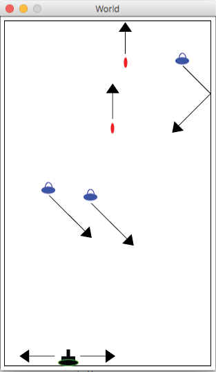

# How to Code

Link: https://www.edx.org/course/how-to-code-simple-data https://www.edx.org/course/how-to-code-complex-data                https://htdp.org/2022-8-7/Book/index.html
Status: Completed

[Design Recipes](media/Design%20Recipes%20258abca055214ca1958db4094b094232.md)

## **BSL**

### Expressions

**Expression**

An expression is an element of a program that is evaluated to produce a value. 

**Evaluate**

In BSL, program execution proceeds by evaluating expressions to produce values. See the Language page for the detailed rules for forming an expression.

To form an **Expression**:

<value>

or

(<primitive> <expression>…)

Example:

```racket
(+ 2 (* 3 4) (- (+ 1 2) 3))
```

**Value** - a value is a data element, such as 1, "foo", (make-cat 10 20) etc.

**Primitive** - a ****primitive is a basic building block provided by BSL that we use when we design our programs. BSL provides primitive data and primitive operations on data.

### ****Evaluation****

An expression that starts with an open parenthesis and an primitive operator is called **call to a primitive**


To evaluate  a primitive call:

- First reduce the operands to values: proceed left to right making sure all the operands are values, for any that are not, evaluate them. These values are called the arguments to the primitive.
- Apply the primitive to those arguments.

```racket
(+ 2 (* 3 4) (- (+ 1 2) 3))
(+ 2 12    ) (- (+ 1 2) 3))
(+ 2 12    ) (-  3      3))
(+ 2 12      0)
14
```

**Operator**

Primitive operators are provided by the BSL language to operate on primitive data. They include  +, -, string-append, substring, image-width and many others.

**Operand**

The expressions following the function name in a function call expression (or the operator name in a primitive call expression) are called operands.

### ****Strings, Images and other Primitive data****

**Boolean** - is a primitive type that is comprised of just two values: true and false

**Number** is a primitive type of data that represents any number, including 0, fractions, decimal numbers and inexact numbers. For example, 1, -5, 3.4, 134.9853957 and #i1.4142135623730951 are all Numbers.

**Integer** is a primitive type of data that represents any positive or negative whole number (… -2, -1, 0, 1, 2 …).

**Natural** is a primitive type data that represents any non-negative whole number (0, 1, 2, 3…).

**String** is a kind of primitive data that consists of symbols “strung” together. Strings are always enclosed in double quotation marks “like this”
It is important to note that if numbers are written inside strings, they are strings not numbers. 

“123” does not have the value of one hundred twenty three, since it is a String, whereas 123 does have the value of one hundred twenty three, since it is a Number.

**Image** is a primitive type of data that represents image, such as the result of a built in image function or a copy-pasted picture.

```racket
"apple"

(string-append "Adda" " " "Lovelance")

"123"

(string-length "apple")

(substring "Caribou" 0 3) ;Car

(require 2htdp/image)

(circle 10 "solid" "red")
(rectangle 30 60 "outline" "blue")
(text "hello" 24 "orange")

(above (circle 10 "solid" "red")
       (circle 20 "solid" "yellow")
       (circle 30 "solid" "green"))

(beside (circle 10 "solid" "red")
       (circle 20 "solid" "yellow")
       (circle 30 "solid" "green"))

(overlay (circle 10 "solid" "red")
       (circle 20 "solid" "yellow")
       (circle 30 "solid" "green"))`
```

### Constant Definitions

A constant is named value defined using define. It is called a constant because once it is defined it never changes.

```racket
(define WIDTH 400)
(define HEIGHT 600)

(* WIDTH HEIGHT)

(define SIZE (* 3 6))         ;a constant definition, the value of SIZE is 18
```

### **Evaluation Rules**

For a **constant reference**, such as SIZE:

- The constant reference evaluates to the defined value of the constant.

### Function Definitions

**Functions** in programs are very similar to functions in mathematics. In math, a function f(x) can be passed a value for x, and it will produce a result based on that value. Functions in programs act the same way. They have a name (in the math example this name was "f ") and one or more parameters (in the math example, the parameter was "x"). Functions also have a body, which is an expression that is evaluated to produce the resulting value of the function.

```racket
(require 2htdp/image)

(define (bulb c)
  (circle 40 "solid" c))

(above (bulb "red")
       (bulb "yellow")
       (bulb "green"))
```

A function call should have the same number of operands as parameters.

```racket
(<name-of-defined-function> <expression> ...)
```

For a **call to a defined function** such as (bulb (string-append "r" "ed")):

- First reduce the operands to values (as for a call to a primitive). These values are called the arguments to the function.
- Replace the function call expression with the body of the function in which every occurrence of the parameter(s) has been replaced by the corresponding argument(s).

For example:

```racket
(bulb (string-append "r" "ed"))
(bulb "red")
(circle 30 "solid" "red")
```

**Parameter**

A parameter is an identifier (or name) used in a function declaration that represents the changing value, or the variable. The parameter(s) appear in parentheses just after the function name. Within the body of the function the parameters stand for the arguments each time the function is called.

```racket
(define (bulb c)            ;In this function definition, c is the only 
	(color 40 "solid" c))     ;parameter of the function.
                            ;The body of the function is itself a primitive call
                            ;to the primitive operator color. 
														; The call has 3 operands.

(bulb (string-append "r" "ed")) ;In this function call expression 
                                ;(string-append "r" "ed") is the operand
                                ;When the function call is evaluated,
                                ;"red" is the argument.
```

**Argument**

An argument is a value that passed to a function or a primitive operation when it is called. The arguments are the values that result from evaluating the operands in the function or primitive call. 

### ****Booleans and Conditionals****

**Boolean** - is a primitive type that is comprised of just two values: true and false

**Predicate** - a function or primitive that produces a Boolean value.

```racket
(define WIDTH 100)  
(define HEIGHT 100) 

(> WIDTH HEIGHT)    ;false 
(>= WIDTH HEIGHT)   ;true

(= 1 2) ;false
(= 1 1) ;true
(> 3 9) ;false
```

**Conditional Expression** - a primitive expression that conditionally evaluates its enclosed expressions. 

### **if expression**

An **if expression** first evaluates the question position, then conditionally evaluates either the true or false answer positions.

```racket
(if <question>
    <true-answer>
    <false-answer>)

<question> must be an expression that evaluates to a boolean.
<true-answer> and <false-answer> must be expressions.
```

For an **if expression**:

- If the question is not a value, evaluate it and replace it with its value.
- If the question is , replace the entire if expression with the true answer expression.
    
    true
    
- If the question is , replace the entire if expression with the false answer expression
    
    false
    
- If the question is a value other than  or , signal an error
    
    true
    
    false
    

For example:

```
(if (> (+ 1 2) 3)
    (* 2 3)
    (* 3 4))      ;since (> (+ 1 2) 3) is an expression, not a value,
                  ;evaluate it left to right
(if (> 3 3)
    (* 2 3)
    (* 3 4))

(if false
    (* 2 3)
    (* 3 4))
                  ;replace entire if expression with the false answer expression
(* 3 4)
                  ;evaluate false answer expression
12
```

### cond expression

 A **cond expression** first evaluates the first question, if it is true it evaluates the first answer; otherwise it starts over with the second question answer pair. An or expression conditionally evaluates its operands until it finds one that produces true. 

```racket
(cond [<question> <answer>]
      ...)
```

Each <question> must be either **else** or an expression that evaluates to a boolean.

Each <answer> must be an expression.

For a **cond expression**:

- If there are no question/answer pairs, signal an error.
- If the first question is not a value, evaluate it and replace it with its value. That is, replace the entire  with a new  in which the first question has been replaced by its value.
- If the first question is  or , replace the entire  expression with the first answer.
- If the first question is  drop the first question/answer pair; that is, replace the  with a new  that does not have the first question/answer pair
- Since the first question is a value other than ,  or , signal an error.

For example:

```racket
(cond [(> 3 3) "more"]
      [(< 3 3) "less"]
      [else "same"])
                        ;the first question is not a value, the expression
                        ;(> 3 3) is evaluated and replaced with a value
(cond [false "more"]
      [(< 3 3) "less"]
      [else "same"])
                        ;the first question is false, so the first
                        ;question/answer pair is dropped
(cond [(< 3 3) "less"]
      [else "same"])
                        ;the first question is not a value, so (< 3 3)
                        ;is evaluated and replaced with its value
(cond [false "less"]
      [else "same"])
                        ;the first question is false, so the first
                        ;question/answer pair is dropped
(cond [else "same"])
                        ;since the question is else, the entire cond expression
                        ;is replaced by the answer
"same"
```

### and expression

```racket
(and <question> ...)
```

Each <question> must be an expression that evaluates to a boolean.

For an **and expression**:

- If there are fewer than 2 operands an error is signalled.
- Evaluate the operands one at a time, left to right, replacing each operand with its value.
- Except that as soon as an operand evaluates to  then immediately produce  from the entire  expression.
- If all operands evaluate to  then produce  from the entire  expression.
    
    ```racket
    (and (< 0 3) 
         (< 3 10))    ;since (< 0 3) is an expression, not a value,
                      ;evaluate it
    (and true        
         (< 3 10))    
    
    (and true
         (< 3 10))    ;now evaluate (< 3 10)       
                   
    (and true
         true)
    
    true              ;entire and produces true
    ```
    

### or expression

```racket
(or <question> ...)
```

Each <question> must be an expression that evaluates to a boolean.

For an **or expression**:

- If there are fewer than two operands an error is signalled.
- Evaluate the operands one at a time, left to right, replacing each operand with its value.
- Except that as soon as an operand evaluates to  then immediately produce  from the entire  expression.
- If all operands evaluate to  then produce  from the entire  expression.

```racket
(or (< 14 0)      ;evaluate (< 14 0)
    (> 14 10)) 
(or false        
    (> 14 10))    ;now evaluate (> 14 10)

(or false
    true)         ;operand produced true

true              ;so entire or produces true
```

## How to Design Worlds example

```racket
; Design a world program with the following behaviour:
;    - A cow walks back and forth across the screen.
;    - When it gets to an edge it changes direction and goes back the other way
;    - When you start the program it should be possible to control how fast a
;      walker your cow is.
;    - Pressing space makes it change direction right away.
;   

(require 2htdp/image)
(require 2htdp/universe)

;; A cow, waddling back and forth across the screen.

;; =================
;; Constants:

(define WIDTH  400)
(define HEIGHT 200)

(define CTR-Y (/ HEIGHT 2)) 

(define RCOW (circle 10 "solid" "red")) ;placeholder for cow
(define LCOW (circle 10 "solid" "red")) ;placeholder cow

(define RCOW- (rotate -2 RCOW))
(define RCOW+ (rotate  2 RCOW))
(define LCOW- (rotate -2 LCOW))
(define LCOW+ (rotate  2 LCOW))

(define MTS (empty-scene WIDTH HEIGHT))

;; =================
;; Data definitions:

(define-struct cow (x dx))
;; Cow is (make-cow Natural[0, WIDTH] Integer)
;; interp. (make-cow x dx) is a cow with x coordinate x and x velocity dx
;;         the x is the center of the cow
;;         x  is in screen coordinates (pixels)
;;         dx is in pixels per tick
;;
(define C1 (make-cow 10  3)) ; at 10, moving left -> right
(define C2 (make-cow 20 -4)) ; at 20, moving left <- right
#;
(define (fn-for-cow c)
  (... (cow-x c)    ;Natural[0, WIDTH]
       (cow-dx c))) ;Integer

;; Template rules used:
;;  - compound: 2 fields

;; =================
;; Functions:

;; Cow -> Cow
;; called to make the cow go for a walk; start with (main (make-cow 0 3))
;; no tests for main function
(define (main c)
  (big-bang c
            (on-tick next-cow)       ; Cow -> Cow
            (to-draw render-cow)     ; Cow -> Image
            (on-key  handle-key)))   ; Cow KeyEvent -> Cow

;; Cow -> Cow  
;; increase cow x by dx; when gets to edge, change dir and move off by 1
(check-expect (next-cow (make-cow 20           3)) (make-cow (+ 20 3)  3)) ;away from edges
(check-expect (next-cow (make-cow 20          -3)) (make-cow (- 20 3) -3))

(check-expect (next-cow (make-cow (- WIDTH 3)  3)) (make-cow WIDTH     3)) ;reaches edge
(check-expect (next-cow (make-cow 3           -3)) (make-cow 0        -3))

(check-expect (next-cow (make-cow (- WIDTH 2)  3)) (make-cow WIDTH    -3)) ;tries to pass edge
(check-expect (next-cow (make-cow 2           -3)) (make-cow 0         3)) 

;(define (next-cow c) c)      ;stub

(define (next-cow c)
  (cond [(> (+ (cow-x c) (cow-dx c)) WIDTH) (make-cow WIDTH (- (cow-dx c)))]
        [(< (+ (cow-x c) (cow-dx c)) 0)     (make-cow 0     (- (cow-dx c)))]
        [else
         (make-cow (+ (cow-x c) (cow-dx c))
                   (cow-dx c))]))

;; Cow -> Image
;; place appropriate cow image on MTS at (cow-x c) and CTR-Y
(check-expect (render-cow (make-cow 99 3))
              (place-image RCOW- 99 CTR-Y MTS))
(check-expect (render-cow (make-cow 33 -3))
              (place-image LCOW- 33 CTR-Y MTS))

;(define (render-cow c) MTS)  ;stub

(define (render-cow c)  
  (place-image (choose-image c) (cow-x c) CTR-Y MTS))

;; Cow -> Image
;; choose [L|R]COW[+|-] depending on cow's direction and position
(check-expect (choose-image (make-cow 1  3)) RCOW-)
(check-expect (choose-image (make-cow 2  3)) RCOW+)
(check-expect (choose-image (make-cow 1 -4)) LCOW-)
(check-expect (choose-image (make-cow 2 -4)) LCOW+)
(check-expect (choose-image (make-cow 1  0)) LCOW-)
(check-expect (choose-image (make-cow 2 -4)) LCOW+)

;(define (choose-image c) RCOW) ;stub

;took template from Cow

(define (choose-image c)
  (if (> (cow-dx c) 0)
      (if (odd? (cow-x c))
          RCOW-
          RCOW+)
      (if (odd? (cow-x c))
          LCOW-
          LCOW+)))

;; Cow KeyEvent-> Cow
;; reverse direction of cow travel when space bar is pressed
(check-expect (handle-key (make-cow (/ WIDTH 2) -3) " ") (make-cow (/ WIDTH 2) 3))
(check-expect (handle-key (make-cow (/ WIDTH 2) 3) " ")     (make-cow (/ WIDTH 2) -3))
(check-expect (handle-key (make-cow (/ WIDTH 2) 3) "a")     (make-cow (/ WIDTH 2) 3))

;(define (handle-key c ke) (make-cow 100 -5)) ;stub

;<template according to KeyEvent>

(define (handle-key c ke)
  (cond [(key=? ke " ") 
         (make-cow (cow-x c)
                   (- (cow-dx c)))]
        [else c]))
```

## Space Invaders Domain Analysis

### During Game



### Game Over


### **Constant:**

- scene width
- scene height
- background
- tank image
- tank y position
- tank speed
- missile image
- missile speed
- missile hit range
- missile starting y
- invader image
- invader speed
- invader movement angle

### Changing**:**

- tank x coordinate
- missile coordinates
- invader coordinates
- number of missiles
- number of invaders

### Bing-bang options:

- on tick
- to draw
- on key
- stop-when

## ****Arbitrary Sized Data - Lists and Recursion****

### **Arbitrary Sized**

Arbitrary Sized information (or data) is information (or data) for which the size is not known at the time the program is designed. A "player with a name and jersey number" is not arbitrary sized, it is compound data with two parts. But "all the players in the league" is arbitrary sized because we do not know ahead of time how many players there will be.

### **Lists**

A list is a data structure that represents a list of items. If there is nothing in the list, its value is empty, whereas if there is data in the list (say the numbers 1 2 3), the value would be (cons 1 (cons 2 (cons 3 empty))). Conses are a type of compound data: The constructor is cons, the different elements in the list can be accessed by using the selectors first and rest, and there are predicates available such as cons? and empty?

```racket
(require 2htdp/image)

empty

(empty? empty) ;true
 
(define L1 (cons "Flames" empty))                ; a list of 1 elemet

(define L2 (cons "Leafs" (cons "Flames" empty))) ; a list of 2 elemets

(define L3 (cons 10 (cons 9 (cons 8 empty))))   ; a list of 3 elements

(define L4 (cons (square 10 "solid" "blue")      ; a list of 2 images
      (cons (triangle 20 "solid" "green")
            empty)))

(first L1)
(first L2)
(first L3)
(first L4)

(rest L1)
(rest L2)
(rest L3)
(rest L4)

; how do I get the second element of a list 
(first (rest L3))

; how do I get the third element of a list 
(first (rest(rest L3)))
```

### **Recursion**

When a function calls itself we say that the function is recursive. When a type comment refers to itself we say that the type involves self-reference. Both are forms of recursion.

```racket
;; Data definitions:

;; ListOfNumber is one of:
;;  - empty
;;  - (cons Number ListOfNumber)
;; interp. each number in the list is an owl weight in ounces
(define LON1 empty)
(define LON2 (cons 60 (cons 42 empty)))
#;
(define (fn-for-lon lon)
  (cond [(empty? lon) (...)]
        [else
         (... (first lon)
              (fn-for-lon (rest lon)))]))

;; Template rules used:
;;  - one of: 2 cases
;;  - atomic distinct: empty
;;  - compound: (cons Number ListOfNumber) 
;;  - self-reference: (rest lon) is ListOfNumber

;; Functions:

;; ListOfNumber -> Number
;; produce sum of Number in lon
(check-expect (sum empty) 0)
(check-expect (sum (cons 20 empty)) 20)
(check-expect (sum (cons 32 (cons 20 empty))) (+ 32 20))

;(define (sum lon) 0) ;stub

(define (sum lon)
  (cond [(empty? lon) 0]
        [else
         (+ (first lon)          
            (sum (rest lon)))]))
```

Well formed self-reference:

- at least one base case
- at least one self reference case

## Reference


```racket
;; Data definitions

(define-struct school (name tuition))
;; School is (make-school String Natural)
;; interp. name is the school's name, tuition is international student's tuition in USD

(define S1 (make-school "School1" 27787))
(define S2 (make-school "School2" 23300))
(define S3 (make-school "School3" 28500))

(define (fn-for-school s)
  (... (school-name s)
       (school-tuition s)))

;; Template rules used:
;;  - compound: (make-school String Natural)

;; ListOfSchool is one of:
;; - empty
;; - (cons School ListOfSchool)
;; intrp. a list of schools
(define LOS1 empty)
(define LOS2 (cons S1 (cons S2 (cons S3 empty))))

(define (fn-for-los los)
  (cond [(empty? los) (...)]
        [else
         (... (fn-for-school(first los))
              (fn-for-los (rest los)))]))

;; Template rules used:
;; - one of: 2 cases
;; - atomic distinct: empty
;; - compound: (cons School ListOfSchool)
;; - reference: (first los)
;; - self-reference: (rest los) is ListOfSchool
```

**Helper Function**

In the design of a complex function it is often useful to design sub-functions that the main function can call to do part of its work. These sub-functions are sometimes called helper functions.

```racket
;; ListOfSchool -> Image
;; produce bar chart showing names and tuitions of consumed schools

(define (chart los)
  (cond [(empty? los) (square 0 "solid" "white")]
        [else
         (beside/align "bottom"
                       (make-bar(first los))
                       (chart (rest los)))]))

;; School -> Image
;; produce the bar for a single school in the bar chart

;(define (make-bar s)  (square 0 "solid" "white")) ;stub

(define (make-bar s)
  (overlay/align "center" "bottom"
                (rotate 90 (text (school-name s) FONT-SIZE FONT-COLOR))
                (rectangle BAR-WIDTH (* (school-tuition s) Y-SCALE) "outline" "black")
                (rectangle BAR-WIDTH (* (school-tuition s) Y-SCALE) "solid" BAR-COLOR)))
```

A more complex example

```racket
;; Data definitions

(define-struct concert (artist venue))
;; Concert is (make-concert String String)
;; interp. a concert with the band playing, and the venue they're playing at
(define C1 (make-concert "Shakey Graves" "Commodore Ballroom"))
(define C2 (make-concert "Tallest Man On Earth" "Orpheum Theatre")) 

#;
(define (fn-for-concert c)
  (... (concert-artist c)
       (concert-venue c)))
    
;; ListOfConcert is one of:
;; - empty
;; - (cons Concert ListOfConcert)
;; interp. a list of concerts
(define LOC1 empty)
(define LOC2 (cons C1 (cons C2 empty)))

#;
(define (fn-for-loc loc)
  (cond [(empty? loc)(...)] 
        [else
         (... (fn-for-concert (first loc))
              (fn-for-loc (rest loc)))]))

;; Template Rules USed
;; One of 2 cases:
;; - atomic distinct: empty
;; - compound: (cons Concert ListOfConcert)
;; - self-reference: (rest loc) is ListOfConcert
;; - reference: (first loc is Concert
     
(define-struct festival (name shows))
;; Festival is (make-festival String ListOfConcert)
;; interp. a festival with name, and list of shows that are part of the festival

(define CANCELLED-FESTIVAL (make-festival "Cancelled" empty))
(define VFMF (make-festival "Vancouver Folk Music Festival" 
	                (cons (make-concert "Hawksley Workman" "Main Stage")
	                      (cons (make-concert "Grace Petrie" "Stage 1")
	                            (cons (make-concert "Mary Gauthier" "Stage 5") empty)))))
#;
(define (fn-for-festival f)
  (... (festival-name f)
       (fn-for-loc (festival-shows f))
       ))

; ;; Suppose you want to change the definition of festival to have three fields:
; ;; the name, the headlining concert, and all the other shows in the festival.
; 
; (define-struct festival2 (name headliner shows))
; ;; Festival is (make-festival String Concert ListOfConcert)
; ;; interp. a festival with three fields: the name, the headlining concert, and all the other shows in the festival.
; 
; (define (fn-for-festival2 f)
;   (... (festival-name f)
;        (fn-for-concert (festival-headliner f))
;        (fn-for-loc (festival-shows f))
;        ))

;; Functions

;; Festival -> ListOfString
;; produces a list of each band paired with where they are performing

(check-expect (festival-schedule CANCELLED-FESTIVAL) empty)
(check-expect (festival-schedule 
		(make-festival "CFMF" (cons (make-concert "Father John Misty" "Main Stage") empty)))
		(cons "Father John Misty: Main Stage" empty))
(check-expect (festival-schedule VFMF)
              (cons "Hawksley Workman: Main Stage"
                    (cons "Grace Petrie: Stage 1"
                          (cons "Mary Gauthier: Stage 5" empty))))

;(define (festival-schedule f) empty)   ; stub

(define (festival-schedule f)
  (display-all-concerts (festival-shows f)))

;; ListOfConcert -> ListOfString
;; produces a list of concert strings in format Artist Name: Venue

;(define (display-all-concerts loc) empty) ;stub

(define (display-all-concerts loc)
  (cond [(empty? loc) empty] 
        [else
         (cons (stringify (first loc))
          (display-all-concerts (rest loc)))]))

;; Concert -> String
;; produces a String formed from band name paired with where they are performing

(define (stringify c)
  (string-append (concert-artist c) ": " (concert-venue c)))
```

## Naturals as self-referential data

There are arbitrarily many natural numbers, so we can use a well-formed self-referential data definition to describe the type Natural. Doing so makes it easy to design functions that count down from a given natural number to 0.

```racket
;; Natural is one of:
;;  - 0
;;  - (add1 Natural)
;; interp. a natural number
(define N0 0)         ;0
(define N1 (add1 N0)) ;1
(define N2 (add1 N1)) ;2

#;
(define (fn-for-natural n)
  (cond [(zero? n) (...)]
        [else
         (... n    ;template rules wouldn't normally put this here, but it's used a lot                             
          (fn-for-natural (sub1 n)))]))

;; Template rules used:
;;  - one-of: two cases
;;  - atomic distinct: 0
;;  - compound: (add1 Natural)
;;  - self-reference: (sub1 n) is Natural

;; Natural -> Natural
;; produce sum of Natural[0, n]
(check-expect (sum 0) 0)
(check-expect (sum 1) 1)
(check-expect (sum 3) (+ 3 2 1 0))

; (define (sum n) 0);

(define (sum n)
  (cond [(zero? n) 0]
        [else
         ( + n (sum (sub1 n)))]))

;; Natural -> ListOfNatural
;; produce (cons n (cons n-1 ... empty)), not including 0
(check-expect (to-list 0) empty)
(check-expect (to-list 1) (cons 1 empty))
(check-expect (to-list 2) (cons 2 (cons 1 empty)))

;(define (to-list n) empty) ;stub

(define (to-list n)
  (cond [(zero? n) empty]
        [else
         (cons  n (to-list (sub1 n)))]))

;; Natural -> Natural
;; compute n * n-1 * n-2 * ... * 1

(check-expect (fact 0) 1)
(check-expect (fact 3) (* 3 2 1 1))

;(define (fact n) 1) ;stub

(define (fact n)
  (cond [(zero? n) 1]
        [else
         (* n (fact (sub1 n)))]))

;; Natural Natural -> ListOfNatural
;; given n and a, n >= a, produce the list (cons n (cons n-1 ... (cons a empty)))

(check-expect (list-from-to 5 5) (cons 5 empty))
(check-expect (list-from-to 10 7) (cons 10 (cons 9 (cons 8 (cons 7 empty)))))

;(define (list-from-to n a) empty) ;stub

(define (list-from-to n a)
  (cond [(zero? (- n a)) (cons a empty)]
        [else
         (cons n (list-from-to (sub1 n) a))]))
```

## Function Composition Examples

**Helper Function**

In the design of a complex function it is often useful to design sub-functions that the main function can call to do part of its work. These sub-functions are sometimes called helper functions.

## Function Composition

Use function composition when a function must perform two or more distinct and complete operations on the consumed data. For example:

- A function that must sort and layout a list of images. First it must sort the complete list and then lay it out. It cannot sort and layout each image one at a time.
- A function that must advance a list of raindrops and then remove the ones that have left the screen. First it must advance all the drops and then remove the ones that have advanced too far. (With difficulty this could be done in a single pass through the list of drops, but it is much more cumbersome to do that way.)

When using function composition the normal template for the function is discarded, and the body of the function has two or more function compositions. So in the case of arrange-images the function design would look like this:

```racket
;; ListOfImage -> Image
;; arrange images left to right in increasing order of size
(check-expect (arrange-images (list I1 I3 I2))
              (beside I1 I2 I3 BLANK))

(define (arrange-images loi)
  (layout-images (sort-images loi)))
```

Which we read as saying "first sort the images, and then layout the sorted list". At the point this is written wish list entries would be created for layout-images and sort-images unless those functions already existed.

Tests for a function that uses function composition should be selected to ensure that the function is calling all the appropriate functions and composing them properly. For example, assuming that images I1, I2 and I3 are in increasing order of size, then this test alone would not be adequate:

```racket
(check-expect (arrange-images (list I1 I2 I3))
              (beside I1 I2 I3 BLANK))
```

Because a faulty implementation of arrange-images that just calls layout-images would pass. Instead a test like the original one above is needed, to ensure that both sort-images and layout-images are called. But note that the tests for arrange-images do not themselves need to fully test both composed functions. They only need to test the composition. That is why arrange-images does not absolutely have to have a base case test. (Although it wouldn't hurt it to have one.)

```racket
; 
; PROBLEM:
; 
; In this problem imagine you have a bunch of pictures that you would like to 
; store as data and present in different ways. We'll do a simple version of that 
; here, and set the stage for a more elaborate version later.
; 
; (A) Design a data definition to represent an arbitrary number of images.
; 
; (B) Design a function called arrange-images that consumes an arbitrary number
;     of images and lays them out left-to-right in increasing order of size.
;     

(require 2htdp/image)

;; Constants:

(define BLANK (square 0 "solid" "white"))

;; for testing:
(define I1 (rectangle 10 20 "solid" "blue"))
(define I2 (rectangle 20 30 "solid" "red"))
(define I3 (rectangle 30 40 "solid" "green"))

;; Data definitions:

;; ListOfImage is one of:
;;  - empty
;;  - (cons Image ListOfImage)
;; interp. An arbitrary number of images
(define LOI1 empty)
(define LOI2 (cons I1(cons I2 empty)))
#;
(define (fn-for-loi loi)
  (cond [(empty? loi) (...)]
        [else
         (... (first loi)
              (fn-for-loi (rest loi)))]))

;; Functions:

;; ListOfImage -> Image
;; lay out images left to right in increasing order of size
;; sort images in increasing order of size and then lay them out left-to-right
(check-expect (arrange-images (cons I1 (cons I2 empty)))
              (beside I1 I2 BLANK))
(check-expect (arrange-images (cons I2 (cons I1 empty)))
              (beside I1 I2 BLANK))

;(define (arrange-images loi) BLANK) ;stub

(define (arrange-images loi)
  (layout-images (sort-images loi)))

;; ListOfImage -> Image
;; place images beside each other in order of list
(check-expect (layout-images empty) BLANK)
(check-expect (layout-images (cons I1 (cons I2 empty)))
              (beside I1 I2 BLANK))

;(define (layout-images loi) BLANK) ;stub

(define (layout-images loi)
  (cond [(empty? loi) BLANK]
        [else
         (beside (first loi)
                 (layout-images (rest loi)))]))

;; ListOfImage -> ListOfImage
;; sort images in increasing order of size (area)
(check-expect (sort-images empty) empty)
(check-expect (sort-images (cons I1 (cons I2 empty)))
              (cons I1 (cons I2 empty)))
(check-expect (sort-images (cons I2 (cons I1 empty)))
              (cons I1 (cons I2 empty)))
(check-expect (sort-images (cons I3 (cons I1 (cons I2 empty))))
              (cons I1 (cons I2 (cons I3 empty))))

;(define (sort-images loi) loi)

(define (sort-images loi)
  (cond [(empty? loi) empty]
        [else
         (insert (first loi)
                 (sort-images (rest loi)))])) ;result of natural recursion will be sorted

;; When an expression must operate on a list and go arbitrarily far into that list,
;; then it must call a helper function to do that.

;; Image ListOfImage -> ListOfImage
;; insert img in proper place in loi (in increasing order of size)
;; ASSUME: loi is already sorted
(check-expect (insert I1 empty) (cons I1 empty))
(check-expect (insert I1 (cons I2 (cons I3 empty))) (cons I1 (cons I2 (cons I3 empty))))
(check-expect (insert I2 (cons I1 (cons I3 empty))) (cons I1 (cons I2 (cons I3 empty))))
(check-expect (insert I3 (cons I1 (cons I2 empty))) (cons I1 (cons I2 (cons I3 empty))))

;(define (insert img loi) loi) ;stub

(define (insert img loi)
  (cond [(empty? loi) (cons img empty)]
        [else
         (if (larger? img (first loi))
             (cons (first loi)
                   (insert img
                           (rest loi)))
             (cons img loi))]))

;; Image Image -> Boolean
;; produce true if img1 is larger than img2  (by area)
;; !!!

(check-expect (larger? (rectangle 3 4 "solid" "red") (rectangle 2 6 "solid" "red")) false)
(check-expect (larger? (rectangle 5 4 "solid" "red") (rectangle 2 6 "solid" "red")) true)
(check-expect (larger? (rectangle 3 5 "solid" "red") (rectangle 2 6 "solid" "red")) true)
(check-expect (larger? (rectangle 3 4 "solid" "red") (rectangle 5 6 "solid" "red")) false)
(check-expect (larger? (rectangle 3 4 "solid" "red") (rectangle 2 7 "solid" "red")) false)

;(define (larger? img1 img2) true) ;stub

(define (larger? img1 img2)
  (> (* (image-width img1) (image-height img1))
     (* (image-width img2) (image-height img2))
     ))
```

Because arrange-images is a function composition, the tests only need to ensure that arrange-strings is composing the functions properly, so no base case test is needed.

**Operating on arbitrary sized data** - When an expression must operate on an arbitrary sized data and go arbitrarily far into that list, then it must call a helper function to do that.

****Domain Knowledge Shift -**** When the body of a function must shift to a new knowledge domain it should call a helper function to do the work in the new domain.

```racket
; Problem 2:
; Consider a test tube filled with solid blobs and bubbles.  Over time the
; solids sink to the bottom of the test tube, and as a consequence the bubbles
; percolate to the top.  Let's capture this idea in BSL.
; 
; Complete the design of a function that takes a list of blobs and sinks each
; solid blob by one. It's okay to assume that a solid blob sinks past any
; neighbor just below it.

;; Blob is one of:
;; - "solid"
;; - "bubble"
;; interp.  a gelatinous blob, either a solid or a bubble
;; Examples are redundant for enumerations
#;
(define (fn-for-blob b)
  (cond [(string=? b "solid") (...)]
        [(string=? b "bubble") (...)]))

;; Template rules used:
;; - one-of: 2 cases
;; - atomic distinct: "solid"
;; - atomic distinct: "bubble"

;; ListOfBlob is one of:
;; - empty
;; - (cons Blob ListOfBlob)
;; interp. a sequence of blobs in a test tube, listed from top to bottom.
(define LOB0 empty) ; empty test tube
(define LOB2 (cons "solid" (cons "bubble" empty))) ; solid blob above a bubble

#;
(define (fn-for-lob lob)
  (cond [(empty? lob) (...)]
        [else
         (... (fn-for-blob (first lob))
              (fn-for-lob (rest lob)))]))

;; Template rules used
;; - one-of: 2 cases
;; - atomic distinct: empty
;; - compound: 2 fields
;; - reference: (first lob) is Blob
;; - self-reference: (rest lob) is ListOfBlob

;; ListOfBlob -> ListOfBlob
;; produce a list of blobs that sinks the given solid blobs by one

(check-expect (sink empty) empty)
(check-expect (sink (cons "bubble" (cons "solid" (cons "bubble" empty))))
              (cons "bubble" (cons "bubble" (cons "solid" empty))))
(check-expect (sink (cons "solid" (cons "solid" (cons "bubble" empty))))
              (cons "bubble" (cons "solid" (cons "solid" empty))))
(check-expect (sink (cons "solid" (cons "bubble" (cons "bubble" empty))))
              (cons "bubble" (cons "solid" (cons "bubble" empty))))
(check-expect (sink (cons "solid" (cons "bubble" (cons "solid" empty))))
              (cons "bubble" (cons "solid" (cons "solid" empty))))
(check-expect (sink (cons "bubble" (cons "solid" (cons "solid" empty))))
              (cons "bubble" (cons "solid" (cons "solid" empty))))
(check-expect (sink (cons "solid" (cons "solid" (cons "bubble" (cons "bubble" empty)))))           
              (cons "bubble" (cons "solid" (cons "solid" (cons "bubble" empty)))))

;(define (sink lob) empty) ; stub

(define (sink lob)
  (cond [(empty? lob) empty]
        [else
         (sink-one (first lob) (sink (rest lob)))]))

;; ListOfBlob Blob -> ListOfBlob
;; sink the blob if it is solid

(check-expect (sink-one "bubble" empty) (cons "bubble" empty))
(check-expect (sink-one "solid" empty) (cons "solid" empty))

(check-expect (sink-one "bubble" (cons "bubble" empty)) (cons "bubble" (cons "bubble" empty)))
(check-expect (sink-one "solid" (cons "bubble" empty)) (cons "bubble" (cons "solid" empty)))

(check-expect (sink-one "bubble" (cons "solid" empty)) (cons "bubble" (cons "solid" empty)))
(check-expect (sink-one "solid" (cons "solid" empty)) (cons "solid" (cons "solid" empty)))

(check-expect (sink-one "bubble" (cons "solid" (cons "solid" empty))) (cons "bubble"  (cons "solid" (cons "solid" empty))))
(check-expect (sink-one "solid"  (cons "solid" (cons "solid" empty))) (cons "solid"  (cons "solid" (cons "solid"  empty))))

(check-expect (sink-one "bubble" (cons "bubble" (cons "bubble" empty))) (cons "bubble"  (cons "bubble" (cons "bubble" empty))))
(check-expect (sink-one "solid"  (cons "bubble" (cons "bubble" empty))) (cons "bubble"  (cons "solid" (cons "bubble"  empty))))

(check-expect (sink-one "bubble" (cons "bubble" (cons "solid" empty))) (cons "bubble"  (cons "bubble" (cons "solid" empty))))
(check-expect (sink-one "solid"  (cons "bubble" (cons "solid" empty))) (cons "bubble"  (cons "solid" (cons "solid"  empty))))

(check-expect (sink-one "bubble" (cons "solid" (cons "bubble" empty))) (cons "bubble"  (cons "solid" (cons "bubble" empty))))
(check-expect (sink-one "solid"  (cons "solid" (cons "bubble" empty))) (cons "solid"  (cons "solid" (cons "bubble"  empty))))
              
;(define (sink-one b lob) empty) ; stub

(define (sink-one b lob)
  (cond [(empty? lob) (cons b empty)]
        [(string=? "solid" b) (cons (first lob) (cons b (rest lob)))]
        [else (cons b lob)]
        ))
```

## Binary Search Trees

### ****List Abbreviations****

It is important to remember that this notation is just an abbreviation for the cons notation. Lists are still made up of conses, and we will still be using first and rest take lists apart.

 We will still be using cons to add a single element to the front of a list.

```racket
(cons "a" (cons "b" (cons "c" empty))) ;(list "a" "b" "c")

(list "a" "b" "c")

(list (+ 1 2) (+ 3 4) (+ 5 6)) ;(list 3 7 11)

(define L1 (list "b" "c"))

(define L2 (list "d" "e" "f"))

(cons "a" L1) ;(list "a" "b" "c")

(list "a" L1) ;(list "a" (list "b" "c"))

(list L1 L2) ;(list (list "b" "c") (list "d" "e" "f")) 

(append L1 L2) ;(list "b" "c" "d" "e" "f")
```

### ****Lookup in List****

We consider the problem of looking up accounts among a large number of user accounts. We will start by representing the arbitrary number of accounts using a list.


```racket
(define-struct account (num name))
;; Accounts is one of:
;;  - empty
;;  - (cons (make-account Natural String) Accounts)
;; interp. a list of accounts, where each 
;;           num  is an account number 
;;           name is the person's first name
(define ACS1 empty)
(define ACS2
  (list (make-account 1 "abc") (make-account 4 "dcj") (make-account 3 "ilk")   (make-account 7 "ruf")))
#;
(define (fn-for-accounts accs)
  (cond [(empty? accs) (...)]
        [else
         (... (account-num  (first accs)) ;Natural
              (account-name (first accs)) ;String
              (fn-for-accounts (rest accs)))]))

;; Accounts Natural -> String or false
;; Try to find account with given number in accounts. If found produce name, otherwise produce false.
(check-expect (lookup ACS1 1) false)
(check-expect (lookup ACS2 2) false)
(check-expect (lookup ACS2 1) "abc")
(check-expect (lookup ACS2 4) "dcj")

;(define (lookup accs n) "") ;stub

(define (lookup accs n)
  (cond [(empty? accs) false]
        [else
         (if (equal? (account-num (first accs)) n)
             (account-name (first accs))
             (lookup (rest accs) n)
         )]))
```


Sorting the list doesn’t help. We still have to go through the list  from the beginning on average look at n/2 accounts

### Binary Search Trees


At each level:

- all accounts in left sub-tree have account number less than root
- all accounts in right sub-tree have account number greater than root

This rule is an **invariant** - it’s true over the whole tree

Example - looking up for 14


At each step where we don’t find what we’re looking for, we eliminate about half the tree.

While search a list, it gets smaller only by 1 at each recursive call.

A BST get smaller by 1/2 at each recursive call.

**On average, we would have to look at log(n) tree nodes**

### ****A Data Definition for BSTs****


```racket
(define-struct node (key val l r))
;; BST (Binary Search Tree) is one of:
;; - false
;; - (make-node Integer String BST BST)
;; interp. false means no BST, or empty BST
;;         key is the node key
;;         val is the node val
;;         l and r are left and right subtrees
;; INVARIANT: for a given node:
;;     key is > all keys in its left child
;;     key is < all keys in its right child
;;     the same key never appears twice in the tree

(define BST0 false)
(define BST1 (make-node 1 "abc" false false))
(define BST4 (make-node 4 "dcj" false (make-node 7 "ruf" false false)))
(define BST3 (make-node 3 "ilk" BST1 BST4))
(define BST42
  (make-node 42 "ily"
             (make-node 27 "wit" (make-node 14 "olp" false false) false)
             (make-node 50 "dug" false false)))
(define BST10
  (make-node 10 "why" BST3 BST42))

(define (fn-for-bst t)
  (cond [(false? t) (...)]
        [else`
         (... (node-key t)              ;Integer
              (node-val t)              ;String
              (fn-for-bst (node-l t))   ;BST
              (fn-for-bst (node-r t))   ;BST
         )]))

;; Template rules used
;; one of: 2 cases
;; - atomic distinct: false
;; - compound: (make-node Integer String BST BST)
;; - self reference: (node-l t) has type BST
;; - self reference: (node-r t) has type BST
```

### Lookup in BSTs


```racket

;; Data definitions:

(define-struct node (key val l r))

;; A BST (Binary Search Tree) is one of:
;;  - false
;;  - (make-node Integer String BST BST)
;; interp. false means no BST, or empty BST
;;         key is the node key
;;         val is the node val
;;         l and r are left and right subtrees
;; INVARIANT: for a given node:
;;     key is > all keys in its l(eft)  child
;;     key is < all keys in its r(ight) child
;;     the same key never appears twice in the tree

(define BST0 false)
(define BST1 (make-node 1 "abc" false false))
(define BST4 (make-node 4 "dcj" false (make-node 7 "ruf" false false)))
(define BST3 (make-node 3 "ilk" BST1 BST4))
(define BST42 
  (make-node 42 "ily"
             (make-node 27 "wit" (make-node 14 "olp" false false) false)
             (make-node 50 "dug" false false)))
(define BST10
  (make-node 10 "why" BST3 BST42))

#;
(define (fn-for-bst t)
  (cond [(false? t) (...)]
        [else
         (... (node-key t)    ;Integer
              (node-val t)    ;String
              (fn-for-bst (node-l t))
              (fn-for-bst (node-r t)))]))

;; Template rules used:
;;  - one of: 2 cases
;;  - atomic-distinct: false
;;  - compound: (make-node Integer String BST BST)
;;  - self reference: (node-l t) has type BST
;;  - self reference: (node-r t) has type BST

;; Functions:

;; BST Natural -> String or false
;; Try to find node with given key, if found produce value; if not found produce false.

(check-expect (lookup-key BST0  99) false)
(check-expect (lookup-key BST1   1) "abc") 
(check-expect (lookup-key BST1   0) false) ;L fail
(check-expect (lookup-key BST1  99) false) ;R fail
(check-expect (lookup-key BST10  1) "abc") ;L L succeed
(check-expect (lookup-key BST10  4) "dcj") ;L R succeed
(check-expect (lookup-key BST10 27) "wit") ;R L succeed
(check-expect (lookup-key BST10 50) "dug") ;R R succeed

;(define (lookup-key t k) "") ;stub

;<template according to BST, and additional atomic parameter k>

(define (lookup-key t k)
  (cond [(false? t) false]
        [else
         (cond[(= k (node-key t)) (node-val t)] 
              [(< k (node-key t))                ;should we go left
                    (lookup-key (node-l t) k)]
              [(> k (node-key t))                ;should we go right
                    (lookup-key (node-r t) k)]      
              )]))
```

## Mutual Reference - Arbitrary Arity Tree and Backtracking Search

### Arbitrary Arity Tree


Arbitrary-size in two dimensions requires two cycles in the type reference graph.

```racket

;; Data definitions:

(define-struct elt (name data subs))
;; Element is (make-elt String Integer ListOfElement)
;; interp. An element in the file system, with name, and EITHER data or subs.
;;         If data is 0, then subs is considered to be list of sub elements.
;;         If data is not 0, then subs is ignored.

;; ListOfElement is one of:
;;  - empty
;;  - (cons Element ListOfElement)
;; interp. A list of file system Elements

(define F1 (make-elt "F1" 1 empty))
(define F2 (make-elt "F2" 2 empty))
(define F3 (make-elt "F3" 3 empty))
(define D4 (make-elt "D4" 0 (list F1 F2)))
(define D5 (make-elt "D5" 0 (list F3)))
(define D6 (make-elt "D6" 0 (list D4 D5)))
```


### ****Templating Mutual Recursion****

```racket
#;
(define (fn-for-element e)
  (... (elt-name e)    ;String
       (elt-data e)    ;Integer
       (fn-for-loe (elt-subs e))))
#;
(define (fn-for-loe loe)
  (cond [(empty? loe) (...)]
        [else
         (... (fn-for-element (first loe))
              (fn-for-loe (rest loe)))]))
```


### Functions on Mutually Recursive Data


```racket
(require 2htdp/image)

;; Data definitions:

(define-struct elt (name data subs))
;; Element is (make-elt String Integer ListOfElement)
;; interp. An element in the file system, with name, and EITHER data or subs.
;;         If data is 0, then subs is considered to be list of sub elements.
;;         If data is not 0, then subs is ignored.

;; ListOfElement is one of:
;;  - empty
;;  - (cons Element ListOfElement)
;; interp. A list of file system Elements

(define F1 (make-elt "F1" 1 empty))
(define F2 (make-elt "F2" 2 empty))
(define F3 (make-elt "F3" 3 empty))
(define D4 (make-elt "D4" 0 (list F1 F2)))
(define D5 (make-elt "D5" 0 (list F3)))
(define D6 (make-elt "D6" 0 (list D4 D5)))
#;
(define (fn-for-element e)
  (... (elt-name e)    ;String
       (elt-data e)    ;Integer
       (fn-for-loe (elt-subs e))))
#;
(define (fn-for-loe loe)
  (cond [(empty? loe) (...)]
        [else
         (... (fn-for-element (first loe))
              (fn-for-loe (rest loe)))])) 

;; Functions:

; PROBLEM
; Design a function that consumes Element and produces the sum of all the file data in 
; the tree.

;; Element -> Integer
;; ListOfElement -> Integer
;; produce the sum of all the data in element (and its subs)
(check-expect (sum-data--element F1) 1)
(check-expect (sum-data--loe empty) 0)
(check-expect (sum-data--element D5) 3)
(check-expect (sum-data--element D4) (+ 1 2))
(check-expect (sum-data--element D6) (+ 1 2 3))

;(define (sum-data--element e) 0)  ;stubs
;(define (sum-data--loe loe) 0)

(define (sum-data--element e)
  (if (zero? (elt-data e))
      (sum-data--loe (elt-subs e))
      (elt-data e))) 

(define (sum-data--loe loe)
  (cond [(empty? loe) 0]
        [else
         (+ (sum-data--element (first loe))
            (sum-data--loe (rest loe)))])) 

; PROBLEM
; Design a function that consumes Element and produces a list of the names of all the elements in 
; the tree. 

;; Element       -> ListOfString
;; ListOfElement -> ListOfString
;; produce list of the names of all the elements in the tree
(check-expect (all-names--loe empty) empty) 
(check-expect (all-names--element F1) (list "F1"))
(check-expect (all-names--element D5) (list "D5" "F3"))
(check-expect (all-names--element D4) (list "D4" "F1" "F2"))
(check-expect (all-names--loe (list D4 D5)) (append (list "D4" "F1" "F2") (list "D5" "F3")))
(check-expect (all-names--element D6) (list "D6" "D4" "F1" "F2" "D5" "F3"))
(check-expect (all-names--element D6) (cons "D6"  (append (list "D4" "F1" "F2") (list "D5" "F3"))))
               
;(define (all-names--element e) empty) ;stubs
;(define (all-names--loe loe)   empty)

(define (all-names--element e)
  (cons (elt-name e)  
        (all-names--loe (elt-subs e))))

(define (all-names--loe loe)
  (cond [(empty? loe) empty]
        [else
         (append (all-names--element (first loe))
                 (all-names--loe (rest loe)))])) 
```

### ****Backtracking Search****

Searching an arbitrary-arity tree for the first element to have a given property leads to a backtracking traversal of the tree.


```racket
(require 2htdp/image)

;; Data definitions:

(define-struct elt (name data subs))
;; Element is (make-elt String Integer ListOfElement)
;; interp. An element in the file system, with name, and EITHER data or subs.
;;         If data is 0, then subs is considered to be list of sub elements.
;;         If data is not 0, then subs is ignored.

;; ListOfElement is one of:
;;  - empty
;;  - (cons Element ListOfElement)
;; interp. A list of file system Elements

(define F1 (make-elt "F1" 1 empty))
(define F2 (make-elt "F2" 2 empty))
(define F3 (make-elt "F3" 3 empty))
(define D4 (make-elt "D4" 0 (list F1 F2)))
(define D5 (make-elt "D5" 0 (list F3)))
(define D6 (make-elt "D6" 0 (list D4 D5)))
#;
(define (fn-for-element e)
  (... (elt-name e)    ;String
       (elt-data e)    ;Integer
       (fn-for-loe (elt-subs e))))
#;
(define (fn-for-loe loe)
  (cond [(empty? loe) (...)]
        [else
         (... (fn-for-element (first loe))
              (fn-for-loe (rest loe)))]))

; PROBLEM
; 
; Design a function that consumes String and Element and looks for a data element with the given 
; name. If it finds that element it produces the data, otherwise it produces false.

;; BACKTRACKING SEARCH
;; String Element -> Integer or false 
;; String ListOfElement -> Integer or false`
;; search the given tree for an element with the given name, produce data if found; false otherwise
(check-expect (find--loe "F3" empty) false)
(check-expect (find--element "F3" F1) false)
(check-expect (find--element "F3" F3) 3)
(check-expect (find--element "D4" D4) 0)
(check-expect (find--element "D6" D6) 0)
(check-expect (find--loe "F2" (cons F1 (cons F2 empty))) 2)
(check-expect (find--loe "F3" (cons F1 (cons F2 empty))) false)
(check-expect (find--element "F3" D4) false)
(check-expect (find--element "F1" D4) 1)
(check-expect (find--element "F2" D4) 2)
(check-expect (find--element "F1" D6) 1)
(check-expect (find--element "F3" D6) 3)
 
;(define (find--element n e) false) ;stubs
;(define (find--loe n loe)   false)

(define (find--element n e)
  (if (string=? (elt-name e) n)
      (elt-data e) 
      (find--loe n (elt-subs e))))

(define (find--loe n loe)
  (cond [(empty? loe) false]
        [else
         (if (not (false? (find--element n (first loe)))) ;is it found in (first loe?) 
             (find--element n (first loe))
             (find--loe n (rest loe)))])) 

;; Finding the same thing twice is a problem. It will be fixed with local expressions
```

Looking for F3 in D6


Each time we get to a failing leaf,  we go back up to its parent and then try the next child, the next sub, that's called backtracking.

## Two One-of Types

```racket
; PROBLEM: design a function that consumes two lists of strings and produces true
; if the first list is a prefix of the second. Prefix means that the elements of
; the first list match the elements of the second list 1 for 1, and the second list
; is at least as long as the first.
; For reference, the ListOfString data definition is provided below.

;; =================
;; Data Definitions:

;; ListOfString is one of:
;; - empty
;; - (cons String ListOfString)
;; interp. a list of strings

(define LS0 empty)
(define LS1 (cons "a" empty))
(define LS2 (cons "a" (cons "b" empty)))
(define LS3 (cons "c" (cons "b" (cons "a" empty))))

#;
(define (fn-for-los los)
  (cond [(empty? los) (...)]
        [else 
         (... (first los)
              (fn-for-los (rest los)))]))

;; ==========
;; Functions:

;; ListOfString ListOfString -> Boolean
;; produce true of lsta is a prefix of lstb

(check-expect (prefix=? empty empty) true)
(check-expect (prefix=? (list "x") empty) false)
(check-expect (prefix=? empty (list "x")) true)
(check-expect (prefix=? (list "x") (list "x")) true)
(check-expect (prefix=? (list "x") (list "y")) false)
(check-expect (prefix=? (list "x" "y") (list "x" "y")) true)
(check-expect (prefix=? (list "x" "x") (list "x" "y")) false)
(check-expect (prefix=? (list "x" ) (list "x" "y")) true)
(check-expect (prefix=? (list "x" "y" "z") (list "x" "y")) false)

;(define (prefix=? lsta lstb) false) ;stub

;(define (prefix=? lsta lstb)
;  (cond [(and (empty? lsta) (empty? lstb)) (...) ]
;        [(and (cons? lsta)  (empty? lstb)) (... lsta ...)]
;        [(and (empty? lsta) (cons? lstb))  (... lstb ...)]
;        [(and (cons? lsta)  (cons? lstb))  (... lsta lstb ...)]))

; lstb                  lsta |    empty    | (cons String ListOfString)
; ---------------------------|------------ |-------------------------------------
; empty                      |    true     |            false
; ---------------------------|-------------|-------------------------------------
; (cons String ListOfString) |    true     |    (and firsts are equal) ... NR 
																									        

(define (prefix=? lsta lstb)
  (cond [(empty? lsta) true]
        [(empty? lstb) false]
        [else (and (string=? (first lsta)
                             (first lstb))
                   (prefix=? (rest lsta) (rest lstb)))]))
```


## Local

### Local

```racket
(local [(define a 1)
        (define b 2)]
  (+ a b))

;; 3

"==================="

(define p "incendio ")

(local [(define p "accio ")
        (define (fetch n) (string-append p n))]
  (fetch "portkey"))

;; accio portkey
```


### Lexical Scoping

```racket
(define a 1)
(define b 2)

(+ a
(local [(define b 3)]
(+ a b))
b)

; 7
```

The concept of lexical scoping allows us to answer questions about what definition any reference to a name refers to.

In the above example, b in the local definition overwrite the global b in the local expression.

### Step by Step Evaluation

```racket
(define b 1)

(+ b
   (local [(define b 2)]
     (* b b))
   b)

; ============================

(+ 1
   (local [(define b 2)]
     (* b b))
   b)

; ============================

(define b_0 2)

(+ 1
   (* b_0 b_0)
   b)

; ============================

(+ 1
   (* 2 b_0)
   b)

; ============================

(+ 1
   4
   b)

; ============================

(+ 1
   4
   1)
; ============================

6
```

### Encapsulation

Lexical scoping is the foundation of encapsulation, a crucial technique for managing complexity of large programs.

```racket
(require 2htdp/image)

;; Data definitions:

(define-struct elt (name data subs))
;; Element is (make-elt String Integer ListOfElement)
;; interp. An element in the file system, with name, and EITHER data or subs.
;;         If data is 0, then subs is considered to be list of sub elements.
;;         If data is not 0, then subs is ignored.

;; ListOfElement is one of:
;;  - empty
;;  - (cons Element ListOfElement)
;; interp. A list of file system Elements

(define F1 (make-elt "F1" 1 empty))
(define F2 (make-elt "F2" 2 empty))
(define F3 (make-elt "F3" 3 empty))
(define D4 (make-elt "D4" 0 (list F1 F2)))
(define D5 (make-elt "D5" 0 (list F3)))
(define D6 (make-elt "D6" 0 (list D4 D5)))

;#
(define (fn-for-element e)
  (local
    [(define (fn-for-element e)
       (... (elt-name e)    ;String
            (elt-data e)    ;Integer
            (fn-for-loe (elt-subs e))))
     (define (fn-for-loe loe)
       (cond [(empty? loe) (...)]
             [else
              (... (fn-for-element (first loe))
                   (fn-for-loe (rest loe)))]))]
    (fn-for-element e)))

;; Functions:

; PROBLEM
; Design a function that consumes Element and produces the sum of all the file data in 
; the tree.

;; Element -> Integer
;; produce the sum of all the data in element (and its subs)

(check-expect (sum-data F1) 1)
(check-expect (sum-data D5) 3)
(check-expect (sum-data D4) (+ 1 2))
(check-expect (sum-data D6) (+ 1 2 3))

(define (sum-data e)
  (local
    [(define (fn-for-element e)
       (+    (elt-data e)    
             (fn-for-loe (elt-subs e))))
     (define (fn-for-loe loe)
       (cond [(empty? loe) 0]
             [else
              (+(fn-for-element (first loe))
                (fn-for-loe (rest loe)))]))]
    (fn-for-element e)))
```

fn-for-element and fn-for-loe are encapsulated

Good candidates for encapsulation:

- One function has one or more helpers closely linked to it.
- The outside program really only want to call the main function, not the helpers.

Steps to encapsulation: 

1. Group all functions to encapsulate together. 

2. Open your definition with the new global function name and necessary parameters. 

3. Open your local expression and then the definition part of the local with [, right before the original function definitions. 

4. Close the definition part of the local with ], after the original function definitions. 

5. Add the trampoline the call the right function defined in the local. 

6. Delete unnecessary signatures, tests and stubs. 

7. Rename tests and possibly stubs.

### Avoiding re-computation with local

.

```racket
;; To avoid calling find--element twice each time

(define (find n e)
  (local
    [(define (find--element n e)
       (if (string=? (elt-name e) n)
           (elt-data e) 
           (find--loe n (elt-subs e))))
     (define (find--loe n loe)
       (cond [(empty? loe) false]
             [else
              (if (not (false? (find--element n (first loe)))) 
                  (find--element n (first loe))
                  (find--loe n (rest loe)))]
             ))]
    (find--element n e)))

;; We can use local
;; But defining the try function, we compute it only one time each time
(define (find n e)
  (local [(define (find--element n e)
            (if (string=? (elt-name e) n)
                (elt-data e) 
                (find--loe n (elt-subs e))))
          
          (define (find--loe n loe)
            (cond [(empty? loe) false]
                  [else
                   (local [(define try (find--element n (first loe)))]
                     (if (not (false? try)) 
                         try
                         (find--loe n (rest loe)))
                     )]
                  ))]
    (find--element n e)))
```

## Abstraction, Higher Order Functions, Abstract Functions, Closures

# Abstraction from examples

### Abstract (verb)

Abstraction means taking two or more expressions or functions that are very similar, and turning those differences into parameters of a more general-purpose **abstract function**. 

Identify two highly repetitive expressions 

introduce a new function

- around one copy of repetitive code
- with a more general name
- add a parameter in varying position
- use parameter in varying position

replace specific expressions

- with calls to abstract function
- pass varying value

```racket
;; ListOfString -> Boolean
;; produce true if los includes "UBC"
(check-expect (contains-ubc? empty) false)
(check-expect (contains-ubc? (cons "McGill" empty)) false)
(check-expect (contains-ubc? (cons "UBC" empty)) true)
(check-expect (contains-ubc? (cons "McGill" (cons "UBC" empty))) true)

;(define (contains-ubc? los) false) ;stub

; Instead of this function definition
#;
(define (contains-ubc? los)
  (cond [(empty? los) false]
        [else
         (if (string=? (first los) "UBC")
             true
             (contains-ubc? (rest los)))]))

; We can replace it with a call to the abstract function
(define (contains-ubc? los) (contains? "UBC" los))

;; ListOfString -> Boolean
;; produce true if los includes "McGill"
(check-expect (contains-mcgill? empty) false)
(check-expect (contains-mcgill? (cons "UBC" empty)) false)
(check-expect (contains-mcgill? (cons "McGill" empty)) true)
(check-expect (contains-mcgill? (cons "UBC" (cons "McGill" empty))) true)

;(define (contains-mcgill? los) false) ;stub

; Instead of this function definition
#;
(define (contains-mcgill? los)
  (cond [(empty? los) false]
        [else
         (if (string=? (first los) "McGill")
             true
             (contains-mcgill? (rest los)))]))

; We can replace it with a call to the abstract function
(define (contains-mcgill? los) (contains? "McGill" los))

;; String (listof String)  -> Boolean

;; produce true if los includes s
(check-expect (contains? "UBC" empty) false)
(check-expect (contains? "UBC" (cons "McGill" empty)) false)
(check-expect (contains? "UBC" (cons "UBC" empty)) true)
(check-expect (contains? "UBC" (cons "McGill" (cons "UBC" empty))) true)
(check-expect (contains? "UBC" (cons "UBC" (cons "McGill" empty))) true)
(check-expect (contains? "Toronto" (cons "UBC" (cons "McGill" empty))) false)

(define (contains? s los)
  (cond [(empty? los) false]
        [else
         (if (string=? (first los) s)
             true
             (contains? s (rest los)))]))
```

# Higher Order Functions

### Higher order function → a function that can consume one or more functions and produce a function

## Map2

Map is taking a list and a function and produces a list with that function applied for every element.

```racket
;; ListOfNumber -> ListOfNumber
;; produce list of sqr of every number in lon
(check-expect (squares empty) empty)
(check-expect (squares (list 3 4)) (list 9 16))

;(define (squares lon) empty) ;stub

(define (squares lon) (map2 sqr lon))

;; ListOfNumber -> ListOfNumber
;; produce list of sqrt of every number in lon
(check-expect (square-roots empty) empty)
(check-expect (square-roots (list 9 16)) (list 3 4))

;(define (square-roots lon) empty) ;stub

(define (square-roots lon) (map2 sqrt lon))
;; ListOfNumber -> ListOfNumber
;; produce list with only positive? elements of lon
(check-expect (positive-only empty) empty)
(check-expect (positive-only (list 1 -2 3 -4)) (list 1 3))

;(define (positive-only lon) empty) ;stub

(define (positive-only lon) (filter2 positive? lon))

;; ListOfNumber -> ListOfNumber
;; produce list with only negative? elements of lon
(check-expect (negative-only empty) empty)
(check-expect (negative-only (list 1 -2 3 -4)) (list -2 -4))

;(define (negative-only lon) empty) ;stub

(define (negative-only lon) (filter2 negative? lon))

;; (X -> Boolean) (listof X) -> (listof X)
; ;given a list, produce a list of only the elements that satisfy the predicate p

(check-expect (filter2 positive? empty) empty)
(check-expect (filter2 positive? (list 1 -2 3 -4)) (list 1 3))
(check-expect (filter2 negative? (list 1 -2 3 -4)) (list -2 -4))

(define (filter2 pred lon)
  (cond [(empty? lon) empty]
        [else
         (if (pred (first lon))
             (cons (first lon)
                   (filter2 pred (rest lon)))
             (filter2 pred (rest lon)))]))
;; given fn and (list n0 n1 ...) produce (list (fn n0) (fn n1) ...)
(check-expect (map2 sqr empty) empty) 
(check-expect (map2 sqr (list 2 4)) (list 4 16))
(check-expect (map2 sqrt (list 16 9)) (list 4 3))
(check-expect (map2 abs (list 2 -3 4)) (list 2 3 4))
(check-expect (map2 string-length (list "a" "b" "def")) (list 1 2 3))
            
;; (X -> Y) (listof X) -> (listof Y)               
(define (map2 fn lon)
  (cond [(empty? lon) empty]
        [else
         (cons (fn (first lon))
               (map2 fn (rest lon)))]))
```

## Filter2

```racket
;; ListOfNumber -> ListOfNumber
;; produce list with only positive? elements of lon
(check-expect (positive-only empty) empty)
(check-expect (positive-only (list 1 -2 3 -4)) (list 1 3))

;(define (positive-only lon) empty) ;stub

(define (positive-only lon) (filter2 positive? lon))

;; ListOfNumber -> ListOfNumber
;; produce list with only negative? elements of lon
(check-expect (negative-only empty) empty)
(check-expect (negative-only (list 1 -2 3 -4)) (list -2 -4))

;(define (negative-only lon) empty) ;stub

(define (negative-only lon) (filter2 negative? lon))

;; (X -> Boolean) (listof X) -> (listof X)
;; given a list, produce a list of only the elements that satisfy the predicate pred

(check-expect (filter2 positive? empty) empty)
(check-expect (filter2 positive? (list 1 -2 3 -4)) (list 1 3))
(check-expect (filter2 negative? (list 1 -2 3 -4)) (list -2 -4))
(check-expect (filter2 false? (list false true false false true))
															(list false false false))

(define (filter2 pred lon)
  (cond [(empty? lon) empty]
        [else
         (if (pred (first lon))
             (cons (first lon)
                   (filter2 pred (rest lon)))
             (filter2 pred (rest lon)))]))
```

# **Built-In Abstract Functions**

```racket
(@signature Natural (Natural -> X) -> (listof X))
;; produces (list (f 0) ... (f (- n 1)))
(define (build-list n f) ...)

(@signature (X -> boolean) (listof X) -> (listof X))
;; produce a list from all those items on lox for which p holds
(define (filter p lox) ...)

(@signature (X -> Y) (listof X) -> (listof Y))
;; produce a list by applying f to each item on lox
;; that is, (map f (list x-1 ... x-n)) = (list (f x-1) ... (f x-n))
(define (map f lox) ...)

(@signature (X -> boolean) (listof X) -> Boolean)
;; produce true if p produces true for every element of lox
(define (andmap p lox) ...)

(@signature (X -> boolean) (listof X) -> Boolean)
;; produce true if p produces true for some element of lox
(define (ormap p lox) ...)

(@signature (X Y -> Y) Y (listof X) -> Y)
;; (foldr f base (list x-1 ... x-n)) = (f x-1 ... (f x-n base))
(define (foldr f base lox) ...)

(@signature (X Y -> Y) Y (listof X) -> Y)
;; (foldl f base (list x-1 ... x-n)) = (f x-n ... (f x-1 base))
(define (foldl f base lox) ...)
```

```racket
(check-expect (map positive? (list 1 -2 3 -4)) (list true false true false))

(check-expect (filter negative? (list 1 -2 3 -4)) (list -2 -4))

;foldr is abstraction of sum and product  
(check-expect (foldr + 0 (list 1 2 3)) (+ 1 2 3 0))   ; 0 is the base case
(check-expect (foldr * 1 (list 1 2 3)) (* 1 2 3 1))   ; 1 is the base casesdsss     

(check-expect (build-list 6 identity) (list 0 1 2 3 4 5))

(check-expect (build-list 4 sqr) (list 0 1 4 9))
```

```racket
;; Some setup data and functions to enable more interesting examples
;; below

(define I1 (rectangle 10 20 "solid" "red"))
(define I2 (rectangle 30 20 "solid" "yellow"))
(define I3 (rectangle 40 50 "solid" "green"))
(define I4 (rectangle 60 50 "solid" "blue"))
(define I5 (rectangle 90 90 "solid" "orange"))

(define LOI1 (list I1 I2 I3 I4 I5))

;; Image -> Boolean
;; produce true if image is wide/tall/square
(check-expect (wide? I1) false)
(check-expect (wide? I2) true)
(check-expect (tall? I3) true)
(check-expect (tall? I4) false)

(define (wide?   img) (> (image-width img) (image-height img)))
(define (tall?   img) (< (image-width img) (image-height img)))

;PROBLEM: 
;Complete the design of the following functions by coding them using a 
;built-in abstract list function.

;; (listof Image) -> (listof Image)
;; produce list of only those images that are wide?
(check-expect (wide-only (list I1 I2 I3 I4 I5)) (list I2 I4))

;(define (wide-only loi) empty) ;stub

(define (wide-only loi)
  (filter wide? loi))

;; (listof Image) -> Boolean
;; are all the images in loi tall?
(check-expect (all-tall? LOI1) false)
(check-expect (all-tall? (list I1 I3)) true)

;(define (all-tall? loi) false) ;stub

(define (all-tall? loi)
  (andmap tall? loi))

;; (listof Number) -> Number
;; sum the elements of a list
(check-expect (sum (list 1 2 3 4)) 10)

;(define (sum lon) 0) ;stub

(define (sum lon)
  (foldr + 0 lon))

;; Natural -> Natural
;; produce the sum of the first n natural numbers
(check-expect (sum-to 3) (+ 0 1 2))

;(define (sum-to n) 0) ;stub

(define (sum-to n)
  (foldr + 0 (build-list n identity))
  )
```

# Closures

When the function passed to an abstract function requires access to a parameter of the enclosing function, it must be locally defined.

A closure is a locally defined function in which the body of the function uses a parameter of the enclosing function definition. The closure can be defined with local or lambda, but it must be defined inside of another function. In the example below, the helper function bigger? is a closure.


```racket
(require 2htdp/image)

;; Some setup data and functions to enable more interesting examples below

(define I1 (rectangle 10 20 "solid" "red"))
(define I2 (rectangle 30 20 "solid" "yellow"))
(define I3 (rectangle 40 50 "solid" "green"))
(define I4 (rectangle 60 50 "solid" "blue"))
(define I5 (rectangle 90 90 "solid" "orange"))

(define LOI1 (list I1 I2 I3 I4 I5))

; PROBLEM: 
; Complete the design of the following functions by completing the body
; which has already been templated to use a built-in abstract list function. 

;; (listof Image) -> (listof Image)
;; produce list of only those images that have width >= height
(check-expect (wide-only (list I1 I2 I3 I4 I5)) (list I2 I4))

;(define (wide-only loi) empty) ;stub

(define (wide-only loi)
  (local [(define (wide? i)
            (> (image-width i)
               (image-height i)))]
    (filter wide? loi)))

;; Number (listof Image) -> (listof Image)
;; produce list of only those images in loi with width >= w
(check-expect (wider-than-only 40 LOI1) (list I4 I5))

;(define (wider-than-only w loi) empty) ;stub

(define (wider-than-only w loi)
  (local [(define (wider-than? i)
            ( > (image-width i) w))]
    (filter wider-than? loi)))
```

When the body of a function you want to pass to an abstract function refers to a parameter of the outer function then the function you want to pass must be defined using local. It simply
cannot be defined at top level!

Since the local is within the scope of (define (wider-than-only w loi)), we can refer to w and loi there -- as we have been doing in all function bodies through the course!

wider-than? is a closure: it "closes over” the value of w passed to wider-than-only


wider-than? takes in i but w is in its body as well!
So it must be defined where w has meaning -- in the definition of wider-than-only.
And to define it within the definition we need to use a local.
This sort of function is called a closure.

```racket
;; (listof Number) -> (listof Number)
;; produce list of each number in lon cubed
(check-expect (cube-all (list 1 2 3)) (list (* 1 1 1) (* 2  2 2) (* 3 3 3)))

;(define (cube-all lon) empty) ;stub

(define (cube-all lon)
  (local [(define (cube x) (* x x x))]
    (map cube lon)))

;; String (listof String) -> (listof String)
;; produce list of all elements of los prefixed by p
(check-expect (prefix-all "accio " (list "portkey" "broom"))
              (list "accio portkey" "accio broom"))

;(define (prefix-all p los) empty) ;stub

(define (prefix-all p los)
  (local [(define (prefix s) (string-append p s))]
    (map prefix los)))
```

# Fold Functions

Abstract functions can be produced directly from templates. This can be wonderfully useful, especially for types involving mutual reference.

```racket
(require 2htdp/image)

;; The type (listof X) means:
;; ListOfX is one of:
;; - empty
;; - (cons X ListOfX)
;; interp. a list of X

;; and the template for (listof X) is:

#;
(define (fn-for-lox lox)
  (cond [(empty? lox) (...)]
        [else
         (... (first lox)
              (fn-for-lox (rest lox)))]))

; PROBLEM:
; Design an abstract fold function for (listof X). 

;; (X Y -> Y) Y (listof X) -> X
;; the abstract fold function for (listof X)
(check-expect (fold + 0 (list 1 2 3)) 6)
(check-expect (fold * 1 (list 1 2 3)) 6)
(check-expect (fold string-append "" (list "a" "bc" "def")) "abcdef")

(define (fold fn b lox)
  (cond [(empty? lox) b]
        [else
         (fn (first lox)
             (fold fn b (rest lox)))]))
```

A fold function is an abstract function based directly on the template (or templates in the case of mutual reference)

When we design a fold function, it is an abstract function based directly off the template, where each … is replaced by a parameter.

```racket
; PROBLEM:
; Complete the function definition for sum using fold. 

;; (listof Number) -> Number
;; add up all numbers in list
(check-expect (sum empty) 0)
(check-expect (sum (list 2 3 4)) 9)

;(define (sum lon) 0) ;stub

(define (sum lon)
  (fold + 0 lon))

; PROBLEM:
; Complete the function definition for juxtapose using foldr. 

;; (listof Image) -> Image
;; juxtapose all images beside each other
(check-expect (juxtapose empty) (square 0 "solid" "white"))
(check-expect (juxtapose (list (triangle 6 "solid" "yellow")
                               (square 10 "solid" "blue")))
              (beside (triangle 6 "solid" "yellow")
                      (square 10 "solid" "blue")
                      (square 0 "solid" "white")))

;(define (juxtapose loi) (square 0 "solid" "white")) ;stub

(define (juxtapose loi)
  (fold beside (square 0 "solid" "white") loi))

; PROBLEM:
; Complete the function definition for copy-list using foldr. 

;; (listof X) -> (listof X)
;; produce copy of list
(check-expect (copy-list empty) empty)
(check-expect (copy-list (list 1 2 3)) (list 1 2 3))

(define (copy-list lox) (fold cons empty lox)) ;stub
```

fold is the abstract function for the (listof X) type, based on its template--so most of the functions we've made based on this template can be implemented using fold.


```racket
; PROBLEM:
; Design an abstract fold function for Element (and (listof Element)). 

(define-struct elt (name data subs))
;; Element is (make-elt String Integer ListOfElement)
;; interp. An element in the file system, with name, and EITHER data or subs.
;;         If data is 0, then subs is considered to be list of sub elements.
;;         If data is not 0, then subs is ignored.

;; ListOfElement is one of:
;;  - empty
;;  - (cons Element ListOfElement)
;; interp. A list of file system Elements

(define F1 (make-elt "F1" 1 empty))
(define F2 (make-elt "F2" 2 empty))
(define F3 (make-elt "F3" 3 empty))
(define D4 (make-elt "D4" 0 (list F1 F2)))
(define D5 (make-elt "D5" 0 (list F3)))
(define D6 (make-elt "D6" 0 (list D4 D5)))

#;
(define (fn-for-element e)
  (local [(define (fn-for-element e)
            (... (elt-name e)    ;String
                 (elt-data e)    ;Integer
                 (fn-for-loe (elt-subs e))))

          (define (fn-for-loe loe)
            (cond [(empty? loe) (...)]
                  [else
                   (... (fn-for-element (first loe))
                        (fn-for-loe (rest loe)))]))]
    (fn-for-element e)))

;; (String Integer Y -> X) (X Y -> Y) Y Element -> X
;; the abstract fold function for Element 

(check-expect (local [(define (c1 n d los) (cons n los))]
                (fold-element c1 append empty D6))
              (list "D6" "D4" "F1" "F2" "D5" "F3"))

(define (fold-element c1 c2 b e)
  (local [(define (fn-for-element e)        ;->X
            (c1 (elt-name e)                ;String            
                (elt-data e)                ;Integer
                (fn-for-loe (elt-subs e)))) ;Y

          (define (fn-for-loe loe)                  ;->Y       
            (cond [(empty? loe) b]
                  [else
                   (c2 (fn-for-element (first loe)) ;X
                       (fn-for-loe (rest loe)))]))] ;Y
    (fn-for-element e)))

; PROBLEM
; Complete the design of sum-data that consumes Element and producs
; the sum of all the data in the element and its subs

;; Element -> Integer
;; produce the sum of all the data in element (and its subs)
(check-expect (sum-data F1) 1)
(check-expect (sum-data D5) 3)
(check-expect (sum-data D4) (+ 1 2))
(check-expect (sum-data D6) (+ 1 2 3))

;(define (sum-data e) 0) ;stub

(define (sum-data e)
  (local [(define (c1 n d loe) (+ d loe))]
    (fold-element c1 + 0 e)))

; PROBLEM 
; Complete the design of all-names that consumes Element and produces a list of the
; names of all the elements in the tree. 

;; Element       -> ListOfString
;; produce list of the names of all the elements in the tree
(check-expect (all-names F1) (list "F1"))
(check-expect (all-names D5) (list "D5" "F3"))
(check-expect (all-names D4) (list "D4" "F1" "F2"))
(check-expect (all-names D6) (list "D6" "D4" "F1" "F2" "D5" "F3"))
               
;(define (all-names e) empty) ;stub

(define (all-names e)
  (local [(define (c1 n d loe) (cons n loe))]
    (fold-element c1 append empty e)))
```

Another example:

```racket
(define-struct region (name type subregions))
;; Region is (make-region String Type (listof Region))
;; interp. a geographical region

;; Type is one of:
;; - "Continent"
;; - "Country"
;; - "Province"
;; - "State"
;; - "City"
;; interp. categories of geographical regions

(define VANCOUVER (make-region "Vancouver" "City" empty))
(define VICTORIA (make-region "Victoria" "City" empty))
(define BC (make-region "British Columbia" "Province" (list VANCOUVER VICTORIA)))
(define CALGARY (make-region "Calgary" "City" empty))
(define EDMONTON (make-region "Edmonton" "City" empty))
(define ALBERTA (make-region "Alberta" "Province" (list CALGARY EDMONTON)))
(define CANADA (make-region "Canada" "Country" (list BC ALBERTA)))

#;
(define (fn-for-region r)
  (local [(define (fn-for-region r)
            (... (region-name r)
                 (fn-for-type (region-type r))
                 (fn-for-lor (region-subregions r))))
          
          (define (fn-for-type t)
            (cond [(string=? t "Continent") (...)]
                  [(string=? t "Country") (...)]
                  [(string=? t "Province") (...)]
                  [(string=? t "State") (...)]
                  [(string=? t "City") (...)]))
          
          (define (fn-for-lor lor)
            (cond [(empty? lor) (...)]
                  [else 
                   (... (fn-for-region (first lor))
                        (fn-for-lor (rest lor)))]))]
    (fn-for-region r)))

;; (String X Z -> Y) (Y Z -> Z) X X X X X Z Region -> Y
;; the abstract fold function for Region

(check-expect (fold-region make-region cons "Continent" "Country" "Province" "State" "City" empty CANADA) CANADA)

(define (fold-region c1 c2 b1 b2 b3 b4 b5 b6 r)
  (local [(define (fn-for-region r)                   ;->Y
            (c1 (region-name r)                       ;String
                (fn-for-type (region-type r))         ;X
                (fn-for-lor (region-subregions r))))  ;Z
          
          (define (fn-for-type t)                     ;->X
            (cond [(string=? t "Continent") b1]       ;X
                  [(string=? t "Country"  ) b2]       ;X
                  [(string=? t "Province" ) b3]       ;X
                  [(string=? t "State"    ) b4]       ;X
                  [(string=? t "City"     ) b5]       ;X
                  ))
          
          (define (fn-for-lor lor)                     ;->Z
            (cond [(empty? lor) b6]                    ;Z
                  [else 
                   (c2 (fn-for-region (first lor))     ;Y
                       (fn-for-lor (rest lor)))]))]    ;Z
    (fn-for-region r)))

(check-expect (all-regions CANADA) (list "Canada" "British Columbia" "Vancouver" "Victoria" "Alberta" "Calgary" "Edmonton"))

(define (all-regions r)
  (local [(define (c1 n t r) (cons n r))]
      (fold-region c1 append "" "" "" "" "" empty r)))
```

## Generative Recursion

# Generative Recursion

Generative recursion is in many ways similar to structural recursion: a function calls itself recursively (or several functions call themselves in mutual recursion). Each recursive call must receive an argument that is in some way "closer to the base case"; this is what guarantees the recursion will eventually terminate. In the structural recursion we have already seen, the nature of the data definitions and the template rules provide us the guarantee that we will reach the base case. But in generative recursion we have to develop that proof for each function we write.

Generative recursion is a new kind of recursion in which the data passed to the recursive call is generated, rather than being a part of the data passed to the current call.

## Generative Recursion

The template for generative recursion is:

```racket
(define (genrec-fn d)
  (cond [(trivial? d) (trivial-answer d)]
        [else
         (... d
              (genrec-fn (next-problem d)))]))
```

# Fractals

Fractals are images that have a recursive structure. They provide a fun first example of generative recursion.


```racket
(define CUTOFF 5)

;; Number -> Image
;; produce a Sierpinski triangle of the given size
(check-expect (stri CUTOFF) (triangle CUTOFF "outline" "red"))
(check-expect (stri (* CUTOFF 2))
              (overlay (triangle (* 2 CUTOFF) "outline" "red")
                       (local [(define sub (triangle CUTOFF "outline" "red"))]
                         (above sub
                                (beside sub sub)))))       
                                      

;(define (stri s) (square 0 "solid" "white")) ;stub

#; ;template
(define (genrec-fn d)
  (cond [(trivial? d) (trivial-answer d)]
        [else
         (... d
              (genrec-fn (next-problem d)))]))

; PROBLEM:
; Construct a three part termination argument for stri.
; Base case: (<= s CUTOFF)
; Reduction step: (/ s 2)
; Argument that repeated application of reduction step will eventually 
; reach the base case:
; As long as teh cutoff is > 0 and s starts >=0 repeated division by 2 will
; eventualy be less than cutoff

(define (stri s)
  (cond [(<= s CUTOFF) (triangle s "outline" "red")]
        [else
         (overlay (triangle s "outline" "red")
                  (local [(define sub (stri (/ s 2)))]
                    (above sub
                           (beside sub sub))))
         ]))
```


```racket
;; Number -> Image
;; produce a Sierpinski carpet of the given size
(check-expect (scarpet CUTOFF) (square CUTOFF "outline" "red"))
(check-expect (scarpet (* CUTOFF 3))
              (overlay (square (* 3 CUTOFF) "outline" "red")
                       (local [(define sub (square CUTOFF "outline" "red"))
                               (define blk (square CUTOFF "solid" "white"))]
                         (above (beside sub sub sub)
                                (beside sub blk sub)
                                (beside sub sub sub)))))

;(define (scarpet s) (square 0 "solid" "white")) ;stub
                                      
#; ;template
(define (genrec-fn d)
  (cond [(trivial? d) (trivial-answer d)]
        [else
         (... d
              (genrec-fn (next-problem d)))]))

; PROBLEM:
; Construct a three part termination argument for stri.
; Base case: (<= s CUTOFF)
; Reduction step: (/ s 3)
; Argument that repeated application of reduction step will eventually 
; reach the base case:
; As long as teh cutoff is > 0 and s starts >=0 repeated division by 3 will
; eventualy be less than cutoff

(define (scarpet s)
  (cond [(<= s CUTOFF) (square s "outline" "red")]
        [else
         (overlay (square s "outline" "red")
                  (local [(define sub (scarpet (/ s 3)))
                          (define blk (square  (/ s 3) "solid" "white"))]
                    (above (beside sub sub sub)
                           (beside sub blk sub)
                           (beside sub sub sub))))
         ]))
```

# ****Termination Arguments****

In generative recursion we no longer can count on well-formed type comments and the template rules to guarantee that the recursion will end. Instead we must formulate our own proof of that for each function that uses generative recursion.


## ****lambda Expressions****

```racket
(require 2htdp/image)

; PROBLEM:
; Rewite each of the following function definitions using lambda. 

;; Number (listof Number) -> (listof Number)
;; produce only elements of lon > threshold
(check-expect (only-bigger 2 empty) empty)
(check-expect (only-bigger 3 (list 2 4 5)) (list 4 5))

#;
(define (only-bigger threshold lon)
  (local [(define (pred n) 
            (> n threshold))]
    (filter pred lon)))

(define (only-bigger threshold lon)
  (filter (lambda (n) (> n threshold)) lon))

;; (listof Image) -> (listof Natural)
;; produce list of areas of images
(check-expect (all-areas (list (rectangle 2 3 "solid" "blue") 
                               (square 10 "solid" "white")))
              (list 6 100))
#;
(define (all-areas loi)
  (local [(define (area i)
            (* (image-width i)
               (image-height i)))]
    (map area loi)))

(define (all-areas loi)
  (map  (lambda (i) (* (image-width i) (image-height i))) loi))

;; (listof Number)  ->  (listof Number)
;; produce list of numbers sorted in ASCENDING order
;; ASSUMPTION: lon contains no duplicates
(check-expect (qsort empty)                empty)
(check-expect (qsort (list 8))             (list 8))
(check-expect (qsort (list 7 8 9))         (list 7 8 9))
(check-expect (qsort (list  4 3 2 1))      (list 1 2 3 4))
(check-expect (qsort (list 6 8 1 9 3 7 2)) (list 1 2 3 6 7 8 9))

#;
(define (qsort lon)
  (if (empty? lon) 
      empty
      (local [(define p (first lon))
              (define (<p? n) (< n p))
              (define (>p? n) (> n p))]
        (append (qsort (filter <p? lon))
                (list p) 
                (qsort (filter >p? lon))))))

(define (qsort lon)
  (if (empty? lon) empty
      (local [(define p (first lon))]
        (append (qsort (filter (lambda (n) (< n p)) lon))
                (list p) 
                (qsort (filter (lambda (n) (< n p)) lon))))))
```


## Template blending

# ****Sudoku****


The goal is to fill every square with Natural[1,9] WITHOUT a duplicate number in any unit (row, column, box)


```racket
(require racket/list) ;gets list-ref, take and drop
        
;;
;; Brute force Sudoku solver
;;
;; In Sudoku, the board is a 9x9 grid of SQUARES.
;; There are 9 ROWS and 9 COLUMNS, there are also 9
;; 3x3 BOXES.  Rows, columns and boxes are all UNITs.
;; So there are 27 units.
;;
;; The idea of the game is to fill each square with
;; a Natural[1, 9] such that no unit contains a duplicate
;; number.
;;

;; =================
;; Data definitions:

;; Val is Natural[1, 9]

;; Board is (listof Val|false)   that is 81 elements long
;; interp.
;;  Visually a board is a 9x9 array of squares, where each square
;;  has a row and column number (r, c).  But we represent it as a
;;  single flat list, in which the rows are layed out one after
;;  another in a linear fashion. (See interp. of Pos below for how
;;  we convert back and forth between (r, c) and position in a board.)

;; Pos is Natural[0, 80]
;; interp.
;;  the position of a square on the board, for a given p, then
;;    - the row    is (quotient p 9)
;;    - the column is (remainder p 9)

;; Convert 0-based row and column to Pos
(define (r-c->pos r c) (+ (* r 9) c))  ;helpful for writing tests

;; Unit is (listof Pos) of length 9
;; interp. 
;;  The position of every square in a unit. There are
;;  27 of these for the 9 rows, 9 columns and 9 boxes.

;; =================
;; Constants:

(define ALL-VALS (list 1 2 3 4 5 6 7 8 9))

(define B false) ;B stands for blank

(define BD1 
  (list B B B B B B B B B
        B B B B B B B B B
        B B B B B B B B B
        B B B B B B B B B
        B B B B B B B B B
        B B B B B B B B B
        B B B B B B B B B
        B B B B B B B B B
        B B B B B B B B B))

(define BD2 
  (list 1 2 3 4 5 6 7 8 9 
        B B B B B B B B B 
        B B B B B B B B B 
        B B B B B B B B B 
        B B B B B B B B B
        B B B B B B B B B
        B B B B B B B B B
        B B B B B B B B B
        B B B B B B B B B))

(define BD3 
  (list 1 B B B B B B B B
        2 B B B B B B B B
        3 B B B B B B B B
        4 B B B B B B B B
        5 B B B B B B B B
        6 B B B B B B B B
        7 B B B B B B B B
        8 B B B B B B B B
        9 B B B B B B B B))

(define BD4                ;easy
  (list 2 7 4 B 9 1 B B 5
        1 B B 5 B B B 9 B
        6 B B B B 3 2 8 B
        B B 1 9 B B B B 8
        B B 5 1 B B 6 B B
        7 B B B 8 B B B 3
        4 B 2 B B B B B 9
        B B B B B B B 7 B
        8 B B 3 4 9 B B B))

(define BD4s               ;solution to 4
  (list 2 7 4 8 9 1 3 6 5
        1 3 8 5 2 6 4 9 7
        6 5 9 4 7 3 2 8 1
        3 2 1 9 6 4 7 5 8
        9 8 5 1 3 7 6 4 2
        7 4 6 2 8 5 9 1 3
        4 6 2 7 5 8 1 3 9
        5 9 3 6 1 2 8 7 4
        8 1 7 3 4 9 5 2 6))

(define BD5                ;hard
  (list 5 B B B B 4 B 7 B
        B 1 B B 5 B 6 B B
        B B 4 9 B B B B B
        B 9 B B B 7 5 B B
        1 8 B 2 B B B B B 
        B B B B B 6 B B B 
        B B 3 B B B B B 8
        B 6 B B 8 B B B 9
        B B 8 B 7 B B 3 1))

(define BD5s               ;solution to 5
  (list 5 3 9 1 6 4 8 7 2
        8 1 2 7 5 3 6 9 4
        6 7 4 9 2 8 3 1 5
        2 9 6 4 1 7 5 8 3
        1 8 7 2 3 5 9 4 6
        3 4 5 8 9 6 1 2 7
        9 2 3 5 4 1 7 6 8
        7 6 1 3 8 2 4 5 9
        4 5 8 6 7 9 2 3 1))

(define BD6                ;hardest ever? (Dr Arto Inkala)
  (list B B 5 3 B B B B B 
        8 B B B B B B 2 B
        B 7 B B 1 B 5 B B 
        4 B B B B 5 3 B B
        B 1 B B 7 B B B 6
        B B 3 2 B B B 8 B
        B 6 B 5 B B B B 9
        B B 4 B B B B 3 B
        B B B B B 9 7 B B))

(define BD7                 ; no solution 
  (list 1 2 3 4 5 6 7 8 B 
        B B B B B B B B 2 
        B B B B B B B B 3 
        B B B B B B B B 4 
        B B B B B B B B 5
        B B B B B B B B 6
        B B B B B B B B 7
        B B B B B B B B 8
        B B B B B B B B 9))

;; Positions of all the rows, columns and boxes:

.
(define ROWS
  (list (list  0  1  2  3  4  5  6  7  8)
        (list  9 10 11 12 13 14 15 16 17)
        (list 18 19 20 21 22 23 24 25 26)
        (list 27 28 29 30 31 32 33 34 35)
        (list 36 37 38 39 40 41 42 43 44)
        (list 45 46 47 48 49 50 51 52 53)
        (list 54 55 56 57 58 59 60 61 62)
        (list 63 64 65 66 67 68 69 70 71)
        (list 72 73 74 75 76 77 78 79 80)))

(define COLS
  (list (list 0  9 18 27 36 45 54 63 72)
        (list 1 10 19 28 37 46 55 64 73)
        (list 2 11 20 29 38 47 56 65 74)
        (list 3 12 21 30 39 48 57 66 75)
        (list 4 13 22 31 40 49 58 67 76)
        (list 5 14 23 32 41 50 59 68 77)
        (list 6 15 24 33 42 51 60 69 78)
        (list 7 16 25 34 43 52 61 70 79)
        (list 8 17 26 35 44 53 62 71 80)))

(define BOXES
  (list (list  0  1  2  9 10 11 18 19 20)
        (list  3  4  5 12 13 14 21 22 23)
        (list  6  7  8 15 16 17 24 25 26)
        (list 27 28 29 36 37 38 45 46 47)
        (list 30 31 32 39 40 41 48 49 50)
        (list 33 34 35 42 43 44 51 52 53)
        (list 54 55 56 63 64 65 72 73 74)
        (list 57 58 59 66 67 68 75 76 77)
        (list 60 61 62 69 70 71 78 79 80)))

(define UNITS (append ROWS COLS BOXES))

;; Board Pos -> Val or false
;; Produce value at given position on board.
(check-expect (read-square BD2 (r-c->pos 0 5)) 6)
(check-expect (read-square BD3 (r-c->pos 7 0)) 8)

(define (read-square bd p)
  (list-ref bd p))               

;; Board Pos Val -> Board
;; produce new board with val at given position
(check-expect (fill-square BD1 (r-c->pos 0 0) 1)
              (cons 1 (rest BD1)))

(define (fill-square bd p nv)
  (append (take bd p)
          (list nv)
          (drop bd (add1 p))))
```

# Sudoku - Template blending


The basic idea behind a Sudoku board solver involves generating a tree of all possible boards that could follow from an initial board and looking for a solution. The tree is generated through a generative recursion process, and each board can have zero to nine valid children, making it an arbitrary-arity tree. The solver uses backtracking search to explore the tree until a solution or a dead end is reached. The key takeaway is that the Sudoku solver involves generative recursion over an arbitrary-arity tree with backtracking search, and that these three aspects are crucial to its design. 

First, templating according to arbitrary-arity tree

```racket
;; =================
;; Functions:

;; Board -> Board or false
;; produce a solution for bd; or false if bd is unsolvable
;; Assume: bd is valid  
(check-expect (solve BD4) BD4s)
(check-expect (solve BD5) BD5s)
(check-expect (solve BD7) false)

;(define (solve bd) false) ;stub

(define (solve bd)
  (local [(define (solve--bd bd)
            (... (solve--lobd (bd-subs bd))))

          (define (solve--lobd lobd)
            (cond [(empty? lobd) (...)]
                  [else
                   (... (solve--bd (first lobd))
                        (solve--lobd (rest lobd)))]))]
    (solve--bd bd)))
```

Then, templating according to generative recursion

```racket
(define (solve bd)
  (local [(define (solve--bd bd)
            (if (trivial? bd)
                (trivial-answer bd)
                (solve--lobd (next-boards bd))))

          (define (solve--lobd lobd)
            (cond [(empty? lobd) (...)]
                  [else
                   (... (solve--bd (first lobd))
                        (solve--lobd (rest lobd)))]))]
    (solve--bd bd)))
```

We can simplify the template

```racket
(define (solve bd)
  (local [(define (solve--bd bd)
            (if (solved? bd)
                bd
                (solve--lobd (next-boards bd))))

          (define (solve--lobd lobd)
            (cond [(empty? lobd) (...)]
                  [else
                   (... (solve--bd (first lobd))
                        (solve--lobd (rest lobd)))]))]
    (solve--bd bd)))
```


Lastly, templating according to backtracking search

```racket
(define (solve bd)
  (local [(define (solve--bd bd)
            (if (solved? bd)
                bd
                (solve--lobd (next-boards bd))))

          (define (solve--lobd lobd)
            (cond [(empty? lobd) false]
                  [else
                   (local [(define try (solve--bd (first lobd)))] ;try first sub-board
                     (if (not (false? try))
                         try
                         (solve--lobd (rest lobd))))]))]
    (solve--bd bd)))
```


# Complete Sudoku

```racket
(require racket/list) ;gets list-ref, take and drop

;;
;; Brute force Sudoku solver
;;
;; In Sudoku, the board is a 9x9 grid of SQUARES.
;; There are 9 ROWS and 9 COLUMNS, there are also 9
;; 3x3 BOXES.  Rows, columns and boxes are all UNITs.
;; So there are 27 units.
;;
;; The idea of the game is to fill each square with
;; a Natural[1, 9] such that no unit contains a duplicate
;; number.
;;

;; =================
;; Data definitions:

;; Val is Natural[1, 9]

;; Board is (listof Val|false)   that is 81 elements long
;; interp.
;;  Visually a board is a 9x9 array of squares, where each square
;;  has a row and column number (r, c).  But we represent it as a
;;  single flat list, in which the rows are layed out one after
;;  another in a linear fashion. (See interp. of Pos below for how
;;  we convert back and forth between (r, c) and position in a board.)

;; Pos is Natural[0, 80]
;; interp.
;;  the position of a square on the board, for a given p, then
;;    - the row    is (quotient p 9)
;;    - the column is (remainder p 9)

;; Convert 0-based row and column to Pos
(define (r-c->pos r c) (+ (* r 9) c))  ;helpful for writing tests

;; Unit is (listof Pos) of length 9
;; interp. 
;;  The position of every square in a unit. There are
;;  27 of these for the 9 rows, 9 columns and 9 boxes.

;; =================
;; Constants:

(define ALL-VALS (list 1 2 3 4 5 6 7 8 9))

(define B false) ;B stands for blank

(define BD1 
  (list B B B B B B B B B
        B B B B B B B B B
        B B B B B B B B B
        B B B B B B B B B
        B B B B B B B B B
        B B B B B B B B B
        B B B B B B B B B
        B B B B B B B B B
        B B B B B B B B B))

(define BD2 
  (list 1 2 3 4 5 6 7 8 9 
        B B B B B B B B B 
        B B B B B B B B B 
        B B B B B B B B B 
        B B B B B B B B B
        B B B B B B B B B
        B B B B B B B B B
        B B B B B B B B B
        B B B B B B B B B))

(define BD3 
  (list 1 B B B B B B B B
        2 B B B B B B B B
        3 B B B B B B B B
        4 B B B B B B B B
        5 B B B B B B B B
        6 B B B B B B B B
        7 B B B B B B B B
        8 B B B B B B B B
        9 B B B B B B B B))

(define BD4                ;easy
  (list 2 7 4 B 9 1 B B 5
        1 B B 5 B B B 9 B
        6 B B B B 3 2 8 B
        B B 1 9 B B B B 8
        B B 5 1 B B 6 B B
        7 B B B 8 B B B 3
        4 B 2 B B B B B 9
        B B B B B B B 7 B
        8 B B 3 4 9 B B B))

(define BD4s               ;solution to 4
  (list 2 7 4 8 9 1 3 6 5
        1 3 8 5 2 6 4 9 7
        6 5 9 4 7 3 2 8 1
        3 2 1 9 6 4 7 5 8
        9 8 5 1 3 7 6 4 2
        7 4 6 2 8 5 9 1 3
        4 6 2 7 5 8 1 3 9
        5 9 3 6 1 2 8 7 4
        8 1 7 3 4 9 5 2 6))

(define BD5                ;hard
  (list 5 B B B B 4 B 7 B
        B 1 B B 5 B 6 B B
        B B 4 9 B B B B B
        B 9 B B B 7 5 B B
        1 8 B 2 B B B B B 
        B B B B B 6 B B B 
        B B 3 B B B B B 8
        B 6 B B 8 B B B 9
        B B 8 B 7 B B 3 1))

(define BD5s               ;solution to 5
  (list 5 3 9 1 6 4 8 7 2
        8 1 2 7 5 3 6 9 4
        6 7 4 9 2 8 3 1 5
        2 9 6 4 1 7 5 8 3
        1 8 7 2 3 5 9 4 6
        3 4 5 8 9 6 1 2 7
        9 2 3 5 4 1 7 6 8
        7 6 1 3 8 2 4 5 9
        4 5 8 6 7 9 2 3 1))

(define BD6                ;hardest ever? (Dr Arto Inkala)
  (list B B 5 3 B B B B B 
        8 B B B B B B 2 B
        B 7 B B 1 B 5 B B 
        4 B B B B 5 3 B B
        B 1 B B 7 B B B 6
        B B 3 2 B B B 8 B
        B 6 B 5 B B B B 9
        B B 4 B B B B 3 B
        B B B B B 9 7 B B))

(define BD7                 ; no solution 
  (list 1 2 3 4 5 6 7 8 B 
        B B B B B B B B 2 
        B B B B B B B B 3 
        B B B B B B B B 4 
        B B B B B B B B 5
        B B B B B B B B 6
        B B B B B B B B 7
        B B B B B B B B 8
        B B B B B B B B 9))

;; Positions of all the rows, columns and boxes:

(define ROWS
  (list (list  0  1  2  3  4  5  6  7  8)
        (list  9 10 11 12 13 14 15 16 17)
        (list 18 19 20 21 22 23 24 25 26)
        (list 27 28 29 30 31 32 33 34 35)
        (list 36 37 38 39 40 41 42 43 44)
        (list 45 46 47 48 49 50 51 52 53)
        (list 54 55 56 57 58 59 60 61 62)
        (list 63 64 65 66 67 68 69 70 71)
        (list 72 73 74 75 76 77 78 79 80)))

(define COLS
  (list (list 0  9 18 27 36 45 54 63 72)
        (list 1 10 19 28 37 46 55 64 73)
        (list 2 11 20 29 38 47 56 65 74)
        (list 3 12 21 30 39 48 57 66 75)
        (list 4 13 22 31 40 49 58 67 76)
        (list 5 14 23 32 41 50 59 68 77)
        (list 6 15 24 33 42 51 60 69 78)
        (list 7 16 25 34 43 52 61 70 79)
        (list 8 17 26 35 44 53 62 71 80)))

(define BOXES
  (list (list  0  1  2  9 10 11 18 19 20)
        (list  3  4  5 12 13 14 21 22 23)
        (list  6  7  8 15 16 17 24 25 26)
        (list 27 28 29 36 37 38 45 46 47)
        (list 30 31 32 39 40 41 48 49 50)
        (list 33 34 35 42 43 44 51 52 53)
        (list 54 55 56 63 64 65 72 73 74)
        (list 57 58 59 66 67 68 75 76 77)
        (list 60 61 62 69 70 71 78 79 80)))

(define UNITS (append ROWS COLS BOXES))

```

```racket
;; =================
;; Functions:

;; Board -> Board or false
;; produce a solution for bd; or false if bd is unsolvable
;; Assume: bd is valid  
(check-expect (solve BD4) BD4s)
(check-expect (solve BD5) BD5s)
(check-expect (solve BD7) false)

;(define (solve bd) false) ;stub

(define (solve bd)
  (local [(define (solve--bd bd)
            (if (solved? bd)
                bd
                (solve--lobd (next-boards bd))))
          
          (define (solve--lobd lobd)
            (cond [(empty? lobd) false]
                  [else 
                   (local [(define try (solve--bd (first lobd)))]
                     (if (not (false? try))
                         try
                         (solve--lobd (rest lobd))))]))]
    
    (solve--bd bd))) 

;; Board -> Boolean
;; produce true if board is solved
;; Assume: board is valid, so it is solved if it is full
(check-expect (solved? BD1) false) 
(check-expect (solved? BD2) false)
(check-expect (solved? BD4s) true)
 
;(define (solved? bd) false) ; stub

(define (solved? bd)
  (andmap number? bd)) 

;; Board -> (listof Board)
;; produce list of valid next boards from board
;; finds first empty square, fills it with Natural[1, 9], keeps only valid boards
(check-expect (next-boards (cons 1 (rest BD1)))
              (list (cons 1 (cons 2 (rest (rest BD1))))
                    (cons 1 (cons 3 (rest (rest BD1))))
                    (cons 1 (cons 4 (rest (rest BD1))))
                    (cons 1 (cons 5 (rest (rest BD1))))
                    (cons 1 (cons 6 (rest (rest BD1))))
                    (cons 1 (cons 7 (rest (rest BD1))))
                    (cons 1 (cons 8 (rest (rest BD1))))
                    (cons 1 (cons 9 (rest (rest BD1))))))

;(define (next-boards bd) empty) ;stub

(define (next-boards bd)
  (keep-only-valid (fill-with-1-9 (find-blank bd) bd)))

;; Board -> Pos
;; produces the position of the first blank square
;; ASSUME: the board has at least one blank square
(check-expect (find-blank BD1) 0)
(check-expect (find-blank (cons 2 (rest BD1))) 1)
(check-expect (find-blank (cons 2 (cons 4 (rest (rest BD1))))) 2)

;(define (find-blank bd) 0) ;stub

(define (find-blank bd)
  (cond [(empty? bd) (error "The board didn't have a blank space.")]
        [else
         (if (false? (first bd))
             0
             (+ 1 (find-blank (rest bd))))]))  

;; Pos Board -> (listof Board)
;; produce 9 boards, with blank filled with Natural[1, 9]
(check-expect (fill-with-1-9 0 BD1)
              (list (cons 1 (rest BD1))
                    (cons 2 (rest BD1))
                    (cons 3 (rest BD1))
                    (cons 4 (rest BD1))
                    (cons 5 (rest BD1))
                    (cons 6 (rest BD1))
                    (cons 7 (rest BD1))
                    (cons 8 (rest BD1))
                    (cons 9 (rest BD1)))) 

;(define (fill-with-1-9 p bd) empty) ;stub

(define (fill-with-1-9 p bd)
  (local [(define (build-one n)
            (fill-square bd p (+ n 1)))]            
    (build-list 9 build-one))) 

;; (listof Board) -> (listof Board)
;; produce list containing only valid boards
(check-expect (keep-only-valid (list (cons 1 (cons 1 (rest (rest BD1))))))
              empty)

;(define (keep-only-valid lobd) empty) ;stub

(define (keep-only-valid lobd)
  (filter valid-board? lobd)) 

;; Board -> Boolean
;; produce true if no unit on the board has the same value twice; false otherwise
(check-expect (valid-board? BD1) true)
(check-expect (valid-board? BD2) true)
(check-expect (valid-board? BD3) true)
(check-expect (valid-board? BD4) true)
(check-expect (valid-board? BD5) true)
(check-expect (valid-board? (cons 2 (rest BD2))) false)
(check-expect (valid-board? (cons 2 (rest BD3))) false)
(check-expect (valid-board? (fill-square BD4 1 6)) false)

;(define (valid-board? bd) false)

(define (valid-board? bd)
  (local [(define (valid-units? lou)      ;(listof Unit) -> Boolean
            (andmap valid-unit? lou))
          
          (define (valid-unit? u)         ;        Unit  -> Boolean
            (no-duplicates?
             (keep-only-values
              (read-unit u))))
          
          (define (read-unit u)           ;Unit -> (listof Val|false)
            (map read-pos u))
          
          (define (read-pos p)            ;Pos -> Val|false
            (read-square bd p))           ;produce contents of bd at p
          
          (define (keep-only-values lovf) ;(listof Val|false) -> (listof Val)
            (filter number? lovf))
          
          (define (no-duplicates? lov)    ;(listof Val) -> Boolean
            (cond [(empty? lov) true]     ;produce true if no value in lov appears twice
                  [else
                   (if (member (first lov) (rest lov))
                       false
                       (no-duplicates? (rest lov)))]))]
  
  (valid-units? UNITS)))

;Unit is ListOfVal

;; Board Pos -> Val or false
;; Produce value at given position on board.
(check-expect (read-square BD2 (r-c->pos 0 5)) 6)
(check-expect (read-square BD3 (r-c->pos 7 0)) 8)

(define (read-square bd p)
  (list-ref bd p))               

;; Board Pos Val -> Board
;; produce new board with val at given position
(check-expect (fill-square BD1 (r-c->pos 0 0) 1)
              (cons 1 (rest BD1)))

(define (fill-square bd p nv)
  (append (take bd p)
          (list nv)
          (drop bd (add1 p))))

; 
; We could have coded read-square and fill-square 'from scratch'
; by using the functions operating on 2 one-of data rule. If we 
; had, the function definitions would look like this:
; 
; 
; ; 
; ; Function on 2 complex data: Board and Pos.
; ; We can assume that p is <= (length bd).
; ; 
; ;               empty     (cons Val-or-False Board)
; ;  0             XXX         (first bd)
; ;  
; ;  (add1 p)      XXX         <natural recursion>
; 
; 
; (define (read-square bd p)  
;   (cond [(zero? p) (first bd)]
;         [else
;          (read-square (rest bd) (sub1 p))]))
; 
; 
; 
; ; 
; ; Function on 2 complex data, Board and Pos.
; ; We can assume that p is <= (length bd).
; ; 
; ;               empty     (cons Val-or-False Board)
; ;  0             XXX         (cons nv (rest bd))
; ;  
; ;  (add1 p)      XXX         (cons (first bd) <natural recursion>)
;  
; (define (fill-square bd p nv)  
;   (cond [(zero? p) (cons nv (rest bd))]
;         [else
;          (cons (first bd)
;                (fill-square (rest bd) (sub1 p) nv))]))
;
```

## Accumulators

## 3 kinds of accumulators

1. context-preserving accumulators (preserve context lost in natural recursion) 
2. result-so-far accumulators (help achieve tail recursion by eliminating the
need for pending operations) 
3. worklist accumulators (help achieve tail recursion by eliminating
the need to retain future recursive calls in pending operations) 

## ****Context Preserving Accumulators****

Following a structural recursion template to walk through arbitrary sized data means we always know where we are, but never know where we have been. 

```racket
; PROBLEM:
; 
; Design a function that consumes a list of elements and produces the list
; consisting of only the 1st, 3rd, 5th and so on elements of its input. 
;
;    (skip1 (list "a" "b" "c" "d")) should produce (list "a" "c")

;; (listof X) -> (listof X)
;; produce list consisting of only the 1st, 3rd, 5th... element of lox
(check-expect (skip1 empty) empty)
(check-expect (skip1 (list "a" "b" "c" "d")) (list "a" "c"))
(check-expect (skip1 (list 1 2 3 4 5 6)) (list 1 3 5))

;(define (skip1 lox) empty) ;stub

#;
(define (skip1 lox)
  (cond [(empty? lox) empty]
        [else
         (if (odd? POSITION-OF-FIRST-LOX)
             (cons (first lox)
                   (skip1 (rest lox)))
             (skip1 (rest lox)))]))
```

Context information about how far we are is lost in the structural recursion template. We need a way to preserve the context of how far we’ve gone

The accumulator HtDF recipe consists of the following steps:

1. Signature. purpose and stub.
2.  Define examples. wrap each in check-expect.
3.  Template and inventory. 
    
    - template as usual, then 
    
    - wrap templated function with outer function of the same name. changing outer parameter name. add trampoline calling inner function with outer parameter name 
    
    - add a new parameter to the inner function (the accumulator) after all ... and in calls to inner function specify type, invariant, and examples of accumulator.
    
4.  Code the function body. 
5. Test and debug until correct


```racket
(define (skip1 lox0)
  ;; acc:
  (local [(define (skip1 lox acc)
            (cond [(empty? lox) (... acc)]
                  [else
                   (... acc
                        (first lox)
                        (skip1 (rest lox)
                               (... acc)))]))]

    (skip1 lox0 ...)))
```

```racket
#;
(define (skip1 lox0)
  ;; acc:
  (local [(define (skip1 lox acc)
            (cond [(empty? lox) (... acc)]
                  [else
                   (... acc
                        (first lox)
                        (skip1 (rest lox)
                               (... acc)))]))]

    (skip1 lox0 ...)))

#;
(define (skip1 lox0)
  ;; acc: Natural; 1-based position of (first lox) on lox0
  ;; (skip1 (list "a" "b" "c") ...)
  ;; (skip1 (list     "b" "c") ...)
  ;; (skip1 (list         "c") ...)
  (local [(define (skip1 lox acc)
            (cond [(empty? lox) (... acc)]
                  [else
                   (... acc
                        (first lox)
                        (skip1 (rest lox)
                               (... acc)))]))]

    (skip1 lox0 ...)))
```


```racket
(define (skip1 lox0)
  ;; acc: Natural; 1-based position of (first lox) on lox0
  ;; (skip1 (list "a" "b" "c") 1)
  ;; (skip1 (list     "b" "c") 2)
  ;; (skip1 (list         "c") 3)
  (local [(define (skip1 lox acc)
            (cond [(empty? lox) empty]
                  [else
                   (if (odd? acc)
                       (cons (first lox)
                             (skip1 (rest lox) (add1 acc)))
                       (skip1 (rest lox) (add1 acc)))]))]

    (skip1 lox0 1)))
```

Updating accumulator (add1) to preserve invariant, we initialize accumulator with value 1

The structural recursion template loses context of how many calls there have been: we use a context-preserving accumulator to keep track of the lost context.

There are always 3 things we need to do when providing the details

1. We need to provide the initial value


1. We need to exploit the accumulator value 
    
    
    
2. We need to preserve this fact we've set about the accumulator, we need to make sure that in each recursive call, it's still the one base position.
    
    
    
    
    
    ## Another example - skipn
    
    ```racket
    ; PROBLEM:
    ; 
    ; Design a function that consumes a list of elements lox and a natural number
    ; n and produces the list formed by including the first element of lox, then 
    ; skipping the next n elements, including an element, skipping the next n 
    ; and so on.
    ; 
    ;  (skipn (list "a" "b" "c" "d" "e" "f") 2) should produce (list "a" "d")
    
    ;; (listof String) Natural -> (listof String)
    
    (check-expect (skipn empty 2) empty)
    (check-expect (skipn (list "a" "b" "c" "d" "e" "f") 0) (list "a" "b" "c" "d" "e" "f"))
    (check-expect (skipn (list "a" "b" "c" "d" "e" "f") 1) (list "a" "c" "e"))
    (check-expect (skipn (list "a" "b" "c" "d" "e" "f") 2) (list "a" "d"))
    
    ;(define (skipn los) empty) ;stub
    
    #;
    ;;templated according to (listof X) and accumulator
    (define (skipn lox0)
      (local [(define (skipn lox acc)
                (cond [(empty? lox) (... acc)]
                      [else
                       (... acc
                           (first lox)
                           (skipn (rest lox)
                                  (... acc)))]))]
        (skipn lox0 ...)))
    ```
    
    
    
    ```racket
    ;;templated according to (listof X) and accumulator
    (define (skipn lox0)
      ;; acc: Natural; the number of elements to skip before including next
      ;; (skipn (list "a" "b" "c" "d") 2) ;outer call
      ;;
      ;; (skipn (list "a" "b" "c" "d") 0) ;include
      ;; (skipn (list     "b" "c" "d") 2) ;don't include
      ;; (skipn (list         "c" "d") 1) ;don't include
      ;; (skipn (list             "d") 0) ;include
      ;; (skipn (list                ) 2) 
      (local [(define (skipn lox acc)
                (cond [(empty? lox) empty]
                      [else
                       (if (zero? acc)
                           (cons (first lox)(skipn (rest lox) n)) ; if acc is zero, reset it to n
                           (skipn (rest lox) (sub1 acc)))]))]     ; else substract 1
        (skipn lox0 0)))
    ```
    

## ****Tail Recursion****

```racket
; PROBLEM:
; 
; (A) Consider the following function that consumes a list of numbers and produces
;     the sum of all the numbers in the list. Use the stepper to analyze the behavior 
;     of this function as the list gets larger and larger. 
;     
; (B) Use an accumulator to design a tail-recursive version of sum.

;; (listof Number) -> Number
;; produce sum of all elements of lon
(check-expect (sum empty) 0)
(check-expect (sum (list 2 4 5)) 11)

(define (sum lon)
  (cond [(empty? lon) 0]
        [else
         (+ (first lon)
            (sum (rest lon)))]))

(sum (list 1 2 3 4 5))
```


The longer the list gets, the more computation is pending and the list of pluses waiting to happen becomes longer. This can lead to the stack, a limited and expensive part of the computer's memory, being used up quickly. To avoid this, a solution to add up long lists without proportionally using more stack would be better.


The reason for the buildup is due to three separate concepts: tail position, function call in tail position, and recursive function call in tail position. The buildup occurs because the plus expression is in tail position, meaning that its result becomes the result of the enclosing function. When an expression's result directly becomes the result of the enclosing function, it is said to be in tail position.


Two expressions, (first lon) and sum, sit in operand position to the plus, (first lon) is not in tail position because its result still needs to be operated on by plus. The call to sum is also not in tail position because its result still needs to be handed to plus. The plus primitive call expression is in tail position. The buildup occurs due to a recursive call that is not in tail position, causing a growing context of pending operations. The non-tail position recursive call to sum causes the build-up and the plus is waiting for it.

```racket
(define (sum lon0)
  (local [(def (sum lon acc)
            (cond [(empty? lon) (... acc)]
                  [else
                   ; (... acc
                   ;    (first lon)
                   (sum (rest lon)
                        (... acc))]))]
(sum lon0 ...)))
```


So the context is building up because the recursive call is not in tail position. To resolve this, we need to make a version of sum in which the recursive call is in tail position, which is called tail recursion. This can be achieved using an accumulator.

```racket
#;
(define (sum lon)
  (cond [(empty? lon) 0]
        [else
         ; (+ (first lon)
            (sum (rest lon)))]))

(define (sum lon0)
  (local [(define (sum lon acc)
            (cond [(empty? lon) (... acc)]
                  [else
                   ; (... acc
                   ;    (first lon)
                        (sum (rest lon)
                             (... acc))]))]
    (sum lon0 ...)))
```


To avoid the addition waiting for SUM, we need to move the (+ (first lon) into the accumulator argument, so that it's not around the call to SUM. This will prevent the build-up of the context.

```racket
(define (sum lon0)
  ;; acc: Number; the sum of the elemets of lon0 seen so far
  ;; (sum (list 2 4 5))
  ;; (sum (list 2 4 5) 0)
  ;; (sum (list   4 5) 2)
  ;; (sum (list     5) 6)
  ;; (sum (list      ) 11)
  (local [(define (sum lon acc)
            (cond [(empty? lon) (... acc)]
                  [else
                   ; (... acc
                   ;    (first lon)
                        (sum (rest lon)
                             (... acc))]))]
    (sum lon0 ...)))
```

```racket
(define (sum lon0)
  ;; acc: Number; the sum of the elemets of lon0 seen so far
  ;; (sum (list 2 4 5))
  ;; (sum (list 2 4 5) 0)
  ;; (sum (list   4 5) 2)
  ;; (sum (list     5) 6)
  ;; (sum (list      ) 11)
  (local [(define (sum lon acc)
            (cond [(empty? lon) acc]
                  [else
                        (sum (rest lon)
                             (+ acc (first lon)))]))]
    (sum lon0 0)))
```


Let's compare the two versions of the sum function. Both have the structural recursion template, but the new version has an added accumulator. The base case of an empty list, which is 0, is in a different place: in the original version, it's in the function definition, while in the new version it's the initial value of the accumulator. The original version has + (first lon) around the recursive call, while in the new version it sits in the accumulator position, adding the current number to the result so far. The elements of the two versions are the same, just rearranged.

In tail recursion using an accumulator, the idea is to move the operations that were outside the recursive call to the accumulator argument. This allows the operations to take place as the recursive call progresses, rather than after it returns, which avoids building up a growing context of pending operations. The accumulator argument is added to the function template and the part of the template that wraps the recursive call is deleted. The operations that were previously outside the recursive call are now performed as the new argument to the accumulator. This way, the operations are performed on the way in, rather than on the way back out.

### Other example

```racket
;; Use an accumulator to design a tail-recursive version of product.

;; (listof Number) -> Number
;; produce the product of all the numbers in lon
(check-expect (product empty) 1)
(check-expect (product (list 1 2 3)) 6)
(check-expect (product (list 2.5 1 -4)) -10)

#;
(define (product lon)
  (cond [(empty? lon) 1]
        [else
         (* (first lon)
            (product (rest lon)))]))

(define (product lon0)
  ;; acc: Number; the sum of the elemets of lon0 seen so far
  ;; (product (list 2 3 4))
  ;; (product (list 2 3 4) 1)
  ;; (product (list   3 4) 2)
  ;; (product (list     4) 6)
  ;; (product (list      ) 24)
  (local [(define (product lon acc)
            (cond [(empty? lon) acc]
                  [else
                   (product (rest lon)
                            (* acc (first lon)))]))]
    (product lon0 1)))
```

## ****Worklist Accumulators****

## Harry Potter Houses

```racket
; PROBLEM:
; 
; In the Harry Potter movies, it is very important which of the four houses a
; wizard is placed in when they are at Hogwarts. This is so important that in 
; most families multiple generations of wizards are all placed in the same family. 
; 
; Design a representation of wizard family trees that includes, for each wizard,
; their name, the house they were placed in at Hogwarts and their children. We
; encourage you to get real information for wizard families from: 
;    http://harrypotter.wikia.com/wiki/Main_Page
; 
; The reason we do this is that designing programs often involves collection
; domain information from a variety of sources and representing it in the program
; as constants of some form. So this problem illustrates a fairly common scenario.
; 
; That said, for reasons having to do entirely with making things fit on the
; screen in later videos, we are going to use the following wizard family tree,
; in which wizards and houses both have 1 letter names.
; 

;; Data definitions:

(define-struct wiz (name house kids))
;; Wizard is (make-wiz String String (listof Wizard))
;; interp. A wizard, with name, house and list of children.

(define Wa (make-wiz "A" "S" empty))
(define Wb (make-wiz "B" "G" empty))
(define Wc (make-wiz "C" "R" empty))
(define Wd (make-wiz "D" "H" empty))
(define We (make-wiz "E" "R" empty))
(define Wf (make-wiz "F" "R" (list Wb)))
(define Wg (make-wiz "G" "S" (list Wa)))
(define Wh (make-wiz "H" "S" (list Wc Wd)))
(define Wi (make-wiz "I" "H" empty))
(define Wj (make-wiz "J" "R" (list We Wf Wg)))
(define Wk (make-wiz "K" "G" (list Wh Wi Wj)))

#; ;template, arb-arity-tree, encapsulated w/ local
(define (fn-for-wiz w)          
  (local [(define (fn-for-wiz w)
            (... (wiz-name w)
                 (wiz-house w)
                 (fn-for-low (wiz-kids w))))
          (define (fn-for-low low)
            (cond [(empty? low) (...)]
                  [else
                   (... (fn-for-wiz (first low))
                        (fn-for-low (rest low)))]))]
    (fn-for-wiz w)))
```


## Accumulators on mutually recursive functions

```racket
;  PROBLEM:
; 
; Design a function that consumes a wizard and produces the names of every 
; wizard in the tree that was placed in the same house as their immediate
; parent. 

;; Wizard -> (listof String)
;; Produce the names of every descendant in the same house as their parent.
(check-expect (same-house-as-parent Wa) empty)
(check-expect (same-house-as-parent Wh) empty)
(check-expect (same-house-as-parent Wg) (list "A"))
(check-expect (same-house-as-parent Wk) (list "E" "F" "A"))

; template from Wizard plus lost context accumulator -> parent-house
(define (same-house-as-parent w)          
  ;; parent-house
  (local [(define (fn-for-wiz w parent-house)
            (... parent-house
                 (wiz-name w)
                 (wiz-house w)
                 (fn-for-low (wiz-kids w)
                             (... parent-house))))
          (define (fn-for-low low parent-house)
            (cond [(empty? low) (... parent-house)]
                  [else
                   (... parent-house
                        (fn-for-wiz (first low) (... parent-house))
                        (fn-for-low (rest low) (... parent-house)))]))]
    (fn-for-wiz w ...)))
```


When adding an accumulator to mutually recursive functions, the accumulator must be added to all the functions and in all their calls. The parent house was added as a parameter to both fn-for-wiz and fn-for-low and included in all mutually recursive calls. This is important to ensure the accumulator is correctly used in all functions.

```racket
; template from Wizard plus lost context accumulator
(define (same-house-as-parent w)          
  ;; parent-house
  (local [(define (fn-for-wiz w parent-house)
            (... parent-house
                 (wiz-name w)
                 (wiz-house w)
                 (fn-for-low (wiz-kids w)
                             (... parent-house))))
          (define (fn-for-low low parent-house)
            (cond [(empty? low) (... parent-house)]
                  [else
                   (... parent-house
                        (fn-for-wiz (first low) (... parent-house))
                        (fn-for-low (rest low) (... parent-house)))]))]
    (fn-for-wiz w ...)))
```


```racket
; template from Wizard plus lost context accumulator
(define (same-house-as-parent w)          
  ;; parent-house is String; the house of this wizard's immediate parent ("" for root of tree)
  ;; (same-hourse-as-parent Wk)
  ;; (fn-for-wiz Wk "")
  ;; (fn-for-wiz Wh "G")
  ;; (fn-for-wiz Wc "S")
  ;; (fn-for-wiz Wd "S")
  ;; (fn-for-wiz Wi "G")
  
  (local [(define (fn-for-wiz w parent-house)
            (if(string=? (wiz-house w) parent-house)
               (cons (wiz-name w) (fn-for-low (wiz-kids w)(wiz-house w)))
               (fn-for-low (wiz-kids w)(wiz-house w))))
            
          (define (fn-for-low low parent-house)
            (cond [(empty? low) empty]
                  [else
                   (append (fn-for-wiz (first low) parent-house)
                           (fn-for-low (rest low) parent-house))]))]
    (fn-for-wiz w "")))
```


## Worklist accumulators - count wizards

```racket
; PROBLEM:
; 
; Design a function that consumes a wizard and produces the number of wizards 
; in that tree (including the root). Your function should be tail recursive.

;; Wizard -> Natural
;; produces the number of wizards in that tree (including the root)
(check-expect (count Wa)  1)
(check-expect (count Wk) 11)

(define (count W) 0)

; template from Wizard, add accumulator for tail recursion
; rsf = result so far

(define (count w)
  ;; rsf is Natural; the number of wizards seen so far
  ;; (count Wk)
  ;; (fn-for-wiz Wk 0)
  ;; (fn-for-wiz Wh 1)
  ;; (fn-for-wiz Wc 2)
  (local [(define (fn-for-wiz w rsf)
            (... rsf
                 (wiz-name w)
                 (wiz-house w)
                 (fn-for-low (wiz-kids w)(... rsf))))
          (define (fn-for-low low rsf )
            (cond [(empty? low) (... rsf)]
                  [else
                   (... rsf
                        (fn-for-wiz (first low)(... rsf))
                        (fn-for-low (rest low)(... rsf)))]))]
    (fn-for-wiz w ...)))
```


We're putting (... rsf) here because the result so far there might have something to do with rsf; 

It might also have to do with the other elements (wiz-name, wiz-house, (first low) etc.)

 But we're just putting rsf in for now.

```racket
#; intermediate step to the solution, this doesn't work yet
(define (count w)
  ;; rsf is Natural; the number of wizards seen so far
  ;; (count Wk)
  ;; (fn-for-wiz Wk 0)
  ;; (fn-for-wiz Wh 1)
  ;; (fn-for-wiz Wc 2)
  (local [(define (fn-for-wiz w rsf)
            ;            (... rsf
            ;                 (wiz-name w)
            ;                 (wiz-house w)
            (fn-for-low (wiz-kids w)
                        (add1 rsf)));)
          (define (fn-for-low low rsf )
            (cond [(empty? low) rsf ]
                  [else
                   (+ (fn-for-wiz (first low) rsf)    
                      (fn-for-low (rest low)  rsf))]))]
    (fn-for-wiz w 0)))
```

***In mutually recursive function w/ accumulators, usually only one of the functions provides NEW values for each accumulator***


```racket
#;
(define (count w)
  ;; rsf is Natural; the number of wizards seen so far
  ;; (count Wk)
  ;; (fn-for-wiz Wk 0)
  ;; (fn-for-wiz Wh 1)
  ;; (fn-for-wiz Wc 2)
  (local [(define (fn-for-wiz w todo rsf) ;todo is (listofWizard) ;wizards we still need to visit with fn-for-wiz
            (fn-for-low (wiz-kids w)
												(... todo)
                        (add1 rsf)))
          (define (fn-for-low low rsf)
            (cond [(empty? low) rsf`]
                  [else
                   ;(+
                   (fn-for-wiz (first low) (rest low) rsf)
                   ; (fn-for-low (rest low)  rsf))
                   ]))]
    (fn-for-wiz w 0)))
```

```racket
(define (count w)
  ;; rsf is Natural; the number of wizards seen so far
  ;; todo is (listofWizard) ;wizards we still need to visit with fn-for-wiz
  ;; (count Wk)
  ;; (fn-for-wiz Wk 0)
  ;; (fn-for-wiz Wh 1)
  ;; (fn-for-wiz Wc 2)
  (local [(define (fn-for-wiz w todo rsf) 
            (fn-for-low (append (wiz-kids w) todo)
                        (add1 rsf)))
          (define (fn-for-low todo rsf)
            (cond [(empty? todo) rsf ]
                  [else
                   (fn-for-wiz (first todo) (rest todo) rsf)
                   ]))]
    (fn-for-wiz w empty 0)))
```

***todo is a worklist accumulator***


In this his tree traversal algorithm, the tree is traversed from node K to nodes H, C, D, I, and J and so on. The algorithm starts with empty list of children that haven't been visited yet and RSF value of zero. At each node, fn-for-wiz is called with the current node as the first argument, the list of children that haven't been visited yet as the second argument, and the RSF value as the third argument. The algorithm is tail recursive, meaning the result is produced only at the end, and each node calls the next one in a straight line until the end of the tree is reached. 

The order of arguments passed to the append function affects the order of traversal in the tree.

### Depth first traversal


### Breadth first traversal


## Same house as parent - using worklist accumulator


***the order of the function call***


Each entry on our worklist accumulator includes: the wizard to visit, together with that wizard’s parent house

The lost-context accumulator is being incorporated into the worklist accumulator

In the tail recursive traversal, the worklist accumulator needs to be more complex to include the parent house of each Wizard. The original lost context accumulator won't work in the tail recursive version, as the calling structure is different. The worklist needs to have compound information, where each entry is both a Wizard to visit and its parent house. The worklist accumulator allows the parent house information to be passed along with each Wizard, allowing the correct parent house information to be retrieved when visiting each Wizard in the traversal.

```racket
; PROBLEM:
; 
; Design a new function definition for same-house-as-parent that is tail 
; recursive. You will need a worklist accumulator.

;; Wizard -> (listof String)
;; Produce the names of every descendant in the same house as their parent.
(check-expect (same-house-as-parent Wa) empty)
(check-expect (same-house-as-parent Wh) empty)
(check-expect (same-house-as-parent Wg) (list "A"))
(check-expect (same-house-as-parent Wk) (list "A" "F" "E"))
```

```racket
; FIRST STEP
; template: from Wizard (arb-arity-tree, encapsulated w/ local)
(define (same-house-as-parent w)          
  (local [(
           define (fn-for-wiz w)
            (... (wiz-name w)
                 (wiz-house w)
                 (fn-for-low (wiz-kids w))))
          
          (define (fn-for-low low)
            (cond [(empty? low) (...)]
                  [else
                   (... (fn-for-wiz (first low))
                        (fn-for-low (rest low)))]))]
    
    (fn-for-wiz w)))
```

```racket
; SECOND STEP
; template: from Wizard (arb-arity-tree, encapsulated w/ local)
;           added result so far accumulator for tail recursion

(define (same-house-as-parent w)          
  (local [
          (define (fn-for-wiz w rsf)
            (... rsf
                 (wiz-name w)
                 (wiz-house w)
                 (fn-for-low (wiz-kids w)(... rsf))))
          
          (define (fn-for-low low rsf)
            (cond [(empty? low) (... rsf)]
                  [else
                   (... rsf
                        (fn-for-wiz (first low))(... rsf)
                        (fn-for-low (rest low))(... rsf))]))]
    
    (fn-for-wiz w ...)))
```

```racket
; THIRD STEP
; template: from Wizard (arb-arity-tree, encapsulated w/ local)
;           added result so far accumulator for tail recursion
;           need to add  worklist accumulator
 
(define (same-house-as-parent w)          
  (local [
          (define (fn-for-wiz w rsf)
            (fn-for-low (... wiz-kids w)(... rsf)))
          
          (define (fn-for-low low rsf)
            (cond [(empty? low) (... rsf)]
                  [else
                   (... fn-for-wiz (first low)(rest low)(... rsf))]))]
    
    (fn-for-wiz w ...)))
```

```racket
; FOURTH STEP
; template: from Wizard (arb-arity-tree, encapsulated w/ local)
;           added result so far accumulator for tail recursion
;           added worklist accumulator for tail recursion
 
(define (same-house-as-parent w)  
	;; todo is (listof ...)    ; a worklist accumulator
  ;; rsf  is (listof String) ; a result so far accumulator        
  (local [
          (define (fn-for-wiz todo w rsf)
            (fn-for-low (append (... wiz-kids w) todo)
                        (... rsf)))
          
          (define (fn-for-low todo rsf)
            (cond [(empty? todo) (...)]
                  [else
                   (... (fn-for-wiz (rest todo) (first todo) (... rsf)))]))]
    
    (fn-for-wiz ... w ...)))
```


```racket
; FIFTH STEP
; template: from Wizard (arb-arity-tree, encapsulated w/ local)
;           added worklist accumulator for tail recursion
;           added result so far accumulator for tail recursion
;           added compound data definition for wish list entries

(define (same-house-as-parent w)
  ;; todo is (listof ...)    ; a worklist accumulator
  ;; rsf  is (listof String) ; a result so far accumulator
  (local [
          (define-struct wle (w ph))
          ;; WLE (worklist entry) is (make-wle Wizard String)
          ;; interp. a worklist entry with the wizard to pass to fn-for-wiz,
          ;;         and that wizard's parent house

          (define (fn-for-wiz todo w ph rsf)
            (fn-for-low (append (... wiz-kids w) todo)
                        (... rsf)))
          
          (define (fn-for-low todo rsf)
            (cond [(empty? todo) (...)]
                  [else
                   (... (fn-for-wiz (rest todo)
                                    (wle-w  (first todo))
                                    (wle-ph  (first todo))
                                    (... rsf)))]))]
    
    (fn-for-wiz ... w ...)))
```

```racket
; SIXTH STEP
; template: from Wizard (arb-arity-tree, encapsulated w/ local)
;           added worklist accumulator for tail recursion
;           added result so far accumulator for tail recursion
;           added compound data definition for wish list entries

(define (same-house-as-parent w)
  ;; todo is (listof ...)    ; a worklist accumulator
  ;; rsf  is (listof String) ; a result so far accumulator
  (local [
          (define-struct wle (w ph))
          ;; WLE (worklist entry) is (make-wle Wizard String)
          ;; interp. a worklist entry with the wizard to pass to fn-for-wiz,
          ;;         and that wizard's parent house

          (define (fn-for-wiz todo w ph rsf)
            (fn-for-low (append
                         (map (lambda (k) (make-wle k (wiz-house w))) (wiz-kids w))
                         todo)
                        (... rsf)))
          
          (define (fn-for-low todo rsf)
            (cond [(empty? todo) (...)]
                  [else
                   (... (fn-for-wiz (rest todo)
                                    (wle-w  (first todo))
                                    (wle-ph  (first todo))
                                    (... rsf)))]))]
    
    (fn-for-wiz ... w ... ...)))
```

***In fn-for-wiz, for each kid (map) in (wiz-kids w), we have to make a worklist entry with the wizard and his parent house.*** 

***In fn-for-low, we are unpacking the worklist entries***

```racket
; FINAL STEP
; template: from Wizard (arb-arity-tree, encapsulated w/ local)
;           added worklist accumulator for tail recursion
;           added result so far accumulator for tail recursion
;           added compound data definition for wish list entries

(define (same-house-as-parent w)
  ;; todo is (listof ...)    ; a worklist accumulator
  ;; rsf  is (listof String) ; a result so far accumulator
  (local [
          (define-struct wle (w ph))
          ;; WLE (worklist entry) is (make-wle Wizard String)
          ;; interp. a worklist entry with the wizard to pass to fn-for-wiz,
          ;;         and that wizard's parent house

          (define (fn-for-wiz todo w ph rsf)
            (fn-for-low (append
                         (map (lambda (k) (make-wle k (wiz-house w))) (wiz-kids w))
                         todo)
                        (if (string=? (wiz-house w) ph)
                            (cons (wiz-name w) rsf)
                            rsf)))
          
          (define (fn-for-low todo rsf)
            (cond [(empty? todo) rsf]
                  [else
                   (fn-for-wiz (rest todo)
                               (wle-w  (first todo))
                               (wle-ph  (first todo))
                               rsf)]))]
    
    (fn-for-wiz empty w "" empty)))
```


The recipes, and in particular the idea that every function can be based on one or
more templates plus details enables you to think about programs in terms of higher
level structure or models.

## Another example - contains key

```racket
; Problem:
; 
; Starting with the following data definition for a binary tree (not a binary search tree) 
; design a tail-recursive function called contains? that consumes a key and a binary tree 
; and produces true if the tree contains the key.
; 

(define-struct node (k v l r))
;; BT is one of:
;;  - false
;;  - (make-node Integer String BT BT)
;; Interp. A binary tree, each node has a key, value and 2 children
(define BT1 false)
(define BT2 (make-node 1 "a"
                       (make-node 6 "f"
                                  (make-node 4 "d" false false)
                                  false)
                       (make-node 7 "g" false false)))

;; Integer BT -> Boolean
;; Produce true if the tree contains the given key
(check-expect (contains? 1 BT1) false)
(check-expect (contains? 1 BT2) true)
(check-expect (contains? 3 BT2) false)
(check-expect (contains? 7 BT2) true)

;; This is the non-tail-recursive version. The lack of tail-recursion is coming from
;; the backtracking to visit unvisited right branches of the tree. An accumulator
;; can be used to keep a list of those branches to visit.
#;
(define (contains? k bt)
  (cond [(false? bt) false]
        [else
         (or (= (node-k bt) k)
             (contains? k (node-l bt))
             (contains? k (node-r bt)))]))

;; Here we have added the accumulator except for the problem of what to do when bt
;; is false.
#;
(define (contains? k bt)
  ;; todo: (listof Node); the list of so far univisited right branches
  (local [(define (contains? bt todo)
            (cond [(false? bt) (... todo)]
                  [else
                   (or (= (node-k bt) k)
                       (contains? (node-l bt)
                                  (cons (node-r bt) todo)))]))]
    (contains? bt empty)))

;; Since todo is a list, and so has arbitrary size, we need to introduce a new
;; helper function. In doing so we rename the original inner function.
#;
(define (contains? k bt)
  ;; todo: (listof Node); the list of so far univisited right branches
  (local [(define (contains/one? bt todo)
            (cond [(false? bt) (contains/list? todo)]
                  [else
                   (or (= (node-k bt) k)
                       (contains/one? (node-l bt)
                                      (cons (node-r bt) todo)))]))
          
          (define (contains/list? todo)
            (cond [(empty? todo) false]
                  [else
                   (contains/one? (first todo) (rest todo))]))]

    (contains/one? bt empty)))

;; In the underlying Racket language, the last operand in an or is in tail position.
;; But in BSL, ISL, and ASL, or is designed to produce an error if any of it's operands
;; produce a non-boolean, so no position of the or is a tail position.  For that
;; reason, at least in the teaching languages, we have to re-write one last time as follows.
#;
; <template from BT + accumulator>
(define (contains? k bt)
  ;; todo: (listof BT); the list of so far univisited right branches
  (local [(define (contains/one? bt todo)
            (cond [(false? bt) (contains/list? todo)]
                  [else
                   (if (= (node-k bt) k)
                       true
                       (contains/one? (node-l bt)
                                      (cons (node-r bt) todo)))]))
          
          (define (contains/list? todo)
            (cond [(empty? todo) false]
                  [else
                   (contains/one? (first todo) (rest todo))]))]
    
    (contains/one? bt empty)))

;; This alternative is also good. It puts both branches on the todo. Note the change
;; in contains/one? as well as the change in the accumulator invariant
; <template from BT + accumulator>
(define (contains? k bt)
  ;; todo: (listof BT); the list of so far univisited subtrees
  (local [(define (contains/one? bt todo)
            (cond [(false? bt) (contains/list? todo)]
                  [else
                   (if (= (node-k bt) k)
                       true
                       (contains/list? (cons (node-l bt)
                                            (cons (node-r bt)
                                                  todo))))]))
          
          (define (contains/list? todo)
            (cond [(empty? todo) false]
                  [else
                   (contains/one? (first todo) (rest todo))]))]
    
    (contains/one? bt empty)))
```

## Graphs

## Graphs


***acyclic graph: graph without cycles***

***directed graph: arrows go in only one direction***

***cyclic graph: cycles can exist***

***As in arbitrary-arity trees, in graphs, a node has***

- ***a name***
- ***zero or more paths to other nodes***


```racket
PROBLEM:

Imagine you are suddenly transported into a mysterious house, in which all
you can see is the name of the room you are in, and any doors that lead OUT
of the room.  One of the things that makes the house so mysterious is that
the doors only go in one direction. You can't see the doors that lead into
the room.

In computer science, we refer to such an information structure as a directed
graph. Like trees, in directed graphs the arrows have direction. But in a
graph it is  possible to go in circles, as in the second example above. It
is also possible for two arrows to lead into a single node, as in the fourth
example.

Design a data definition to represent such houses. Also provide example data
for the four houses above.

(define-struct room(name exits))
;; Room  is (make-room String (listof Room))
;; interp. the room's name, and a list of rooms tht the exits lead to
```


```racket
(define H1 (make-room "A" (list (make-room "B"))))
```


***Both A and B refer to each other → unlike a tree there’s no clear hierarchical structure where the parent contains children but the children do not contain their parent.***

***this -0- is a name for the result of the make-room expression for A***

***this name will allow us to refer to this room; even inside the expression that makes the room!***


```racket
(define H2 (shared ((-0- (make-room "A" (list (make-room "B" (list -0-))))))
             -0-))
```

***-0- is a special name for the result of the next expression which we’ll be able to use in circular structure***


```racket
> H2
(shared ((-0- (make-room "A" (list (make-room "B" (list -0-)))))) -0-)
> (room-name H2)
"A"
> (length (room-exits H2))
1
> (map room-name (room-exits H2))
(list "B")
```


```racket
(define H3
  (shared ((-0- (make-room "A"
                           (list (make-room "B"
                                            (list (make-room "C" (list -0-))))))))
    -0-))
```

Another way to define 

```racket
(define H3
  (shared ((-A- (make-room "A" (list -B-)))
           (-B- (make-room "B" (list -C-)))
           (-C- (make-room "C" (list -A-))))
    -A-))
```


```racket
> H3
(shared ((-0- (make-room "A" (list (make-room "B" (list (make-room "C" (list -0-)))))))) -0-)
> (room-name H3)
"A"
> (length (room-exits H3))
1
> (map room-name (room-exits H2))
(list "B")
```


```racket
(define H4
  (shared ((-A- (make-room "A" (list -B- -D-)))
           (-B- (make-room "B" (list -C- -E-)))
           (-C- (make-room "C" (list -B-)))
           (-D- (make-room "D" (list -E-)))
           (-E- (make-room "E" (list -F- -A-)))
           (-F- (make-room "F" (list))))
    -A-))
```

```racket
> H4
(shared ((-0- (make-room "A" (list -3- (make-room "D" (list -10-)))))
         (-10- (make-room "E" (list (make-room "F" '()) -0-)))
         (-3- (make-room "B" (list (make-room "C" (list -3-)) -10-))))
  -0-)
```


```racket
(define H5
  (shared ((-A- (make-room "A" (list -B- -C-)))
           (-B- (make-room "B" (list -E-)))
           (-C- (make-room "C" (list -B- -D-)))
           (-D- (make-room "D" empty))
           (-E- (make-room "E" (list -C- -D-))))
    -A-))
```

## Templating


In the context of working with house graphs (graphs of rooms), having an accumulator that keeps track of every room you've already visited is helpful in detecting when you are going in a circle. The accumulator value progresses as you traverse the graph, and note that because there can be more than one arrow that comes into a given room in a graph, the accumulator value may be different depending on which arrow you follow.

As an example, if you start at room A (which has an empty accumulator), and then visit rooms B and C, the accumulator value will be "A" and "AB" respectively. When you return to room B, the accumulator value will be "ABC", indicating that you have visited that room before and are going in a circle.

Therefore, having a context preserving accumulator can help in identifying cycles in the graph and allowing you to stop traversing the graph when you reach a room that you have already visited.

```racket
;; template: structural recursion, encapsulate w/ local, tail-recursive w/ worklist,
;;           context-preserving accumulator -> what room have we already visited

(define (fn-for-house r0)
  ;; todo is (listof Room) ; a worklist accumulator
  ;; visited is (listof String) ; context preserving accumulator, names of rooms already visited
  (local [
          (define (fn-for-room r todo visited)
            (if (member (room-name r) visited)
                (fn-for-lor todo visited)
                (fn-for-lor (append (room-exits r) todo)
                            (cons (room-name r) visited)))) ; (... (room-name r)) 
          
          (define (fn-for-lor todo visited)
            (cond [(empty? todo) (...)]
                  [else
                   (fn-for-room (first todo)
                                (rest todo)
                                visited)]))]
    
    (fn-for-room r0 empty empty)))
```


## ****Problem: reachable?****

```racket
; PROBLEM:
; 
; Design a function that consumes a Room and a room name, and produces true
; if it is possible to reach a room with the given name starting at the given
; room. For example:
; 
;   (reachable? H1 "A") produces true
;   (reachable? H1 "B") produces true
;   (reachable? H1 "C") produces false
;   (reachable? H4 "F") produces true
;   
; But note that if you defined H4F to be the room named F in the H4 house then 
; (reachable? H4F "A") would produce false because it is not possible to get
; to A from F in that house.

;; Room String -> Boolean
;; produce true if starting at r0 it is possible to reach a room named rn 
(check-expect (reachable? H1 "A") true)
(check-expect (reachable? H1 "B") true)
(check-expect (reachable? H1 "C") false)
(check-expect (reachable? (first (room-exits H2)) "A") true) ;starting from B going to A
(check-expect (reachable? H4 "F") true)
```

```racket
(define (reachable? r0 rn)
  ;; todo is (listof Room); a worklist accumulator
  (local [(define (fn-for-room r todo visited) 
            (cond [(string=? (room-name r) rn) true]
                  [(member (room-name r) visited)
                   (fn-for-lor todo visited)]
                  [else
                   (fn-for-lor (append (room-exits r) todo)
                               (cons (room-name r) visited))]))
          (define (fn-for-lor todo visited)
            (cond [(empty? todo) false]
                  [else
                   (fn-for-room (first todo) 
                                (rest todo)
                                visited)]))]
    (fn-for-room r0 empty empty)))
```

## Problem: num-rooms

```racket
; PROBLEM:
; 
; Design a function that consumes a Room and produces the total number of rooms
; reachable from a given room, including the room itself

;; Room -> Natural
;; produce the total number of rooms reachable from a given room, including the room itself

(check-expect (num-rooms H4) 6)

(define (num-rooms r0)
  ;; todo is (listof Room); a worklist accumulator
  ;; visited is (listof String); context preserving acc, names of rooms already visited
  (local [
          (define (fn-for-room r todo visited)
            (if (member (room-name r) visited)
                (fn-for-lor todo visited)
                (fn-for-lor (append (room-exits r) todo) 
                            (cons (room-name r) visited))))

          (define (fn-for-lor todo visited)
            (cond [(empty? todo) (length visited)] 
                  [else 
                   (fn-for-room (first todo)
                                (rest todo)
                                visited
                                )]))]
    (fn-for-room r0 empty empty)))
```

## Problem: max_exits_to

```racket
; PROBLEM:
; Using the following data definition, design a function that produces the room to which the greatest 
; number of other rooms have exits (in the case of a tie you can produce any of the rooms in the tie).

;; Functions:

;; Room -> Room
;; produce the room to which the greatest number of other rooms have exits

(check-expect (max-exits-to H1) (first (room-exits H1)))
(check-expect (max-exits-to H2) (shared ((-A- (make-room "A" (list -B-)))
                                         (-B- (make-room "B" (list -A-))))
                                  -B-))

(check-expect (max-exits-to H4) 
              (shared ((-A- (make-room "A" (list -B- -D-)))
                       (-B- (make-room "B" (list -C- -E-)))
                       (-C- (make-room "C" (list -B-)))
                       (-D- (make-room "D" (list -E-)))
                       (-E- (make-room "E" (list -F- -A-)))
                       (-F- (make-room "F" (list))))
                -E-))

(define (max-exits-to r0)
  (local [;; RoomNExits is (make-rne Room Natural)
          ;; interp. the number of exits recorded for a given room
          (define-struct rne (r n))
          
          ;; todo is (listof Room); a worklist accumulator
          ;; visited is (listof String); context preserving accumulator, names of rooms already visited
          ;; rsf is (listof RoomNExits); the number of exits leading to rooms so far
          (define (fn-for-room r todo visited rsf) 
            (if (member (room-name r) visited)
                (fn-for-lor todo visited rsf)
                (fn-for-lor (append (room-exits r) todo)
                            (cons (room-name r) visited)
                            (merge-room r rsf))))
          (define (fn-for-lor todo visited rsf)
            (cond [(empty? todo) rsf]
                  [else
                   (fn-for-room (first todo)  
                                (rest todo)
                                visited
                                rsf)]))
          ;; add one new room to rsf
          (define (merge-room r rsf)
            (foldr merge-exit rsf (room-exits r)))
          ;; add one new exit to rsf
          (define (merge-exit r lorne)
            (cond [(empty? lorne) (list (make-rne r 1))]
                  [else
                   (if (string=? (room-name r) (room-name (rne-r (first lorne))))
                       (cons (make-rne r
                                       (add1 (rne-n (first lorne))))
                             (rest lorne))
                       (cons (first lorne)
                             (merge-exit r (rest lorne))))]))
          ;; pick the room from rsf that has the most exits to it
          (define (pick-max rsf)
            (rne-r
             (foldr (λ (e1 e2)
                      (if (> (rne-n e1) (rne-n e2))
                          e1
                          e2))
                    (first rsf)
                    (rest rsf))))]
    ;; function composition
    (pick-max (fn-for-room r0 empty empty empty))))
```

The function **`merge-exit`** takes two inputs: **`r`** and **`lorne`**. **`r`** is a Room, and **`lorne`** is a list of RoomNExits, which keeps track of the number of exits for a given room.

The purpose of **`merge-exit`** is to update the **`lorne`** list to include information about the exits from the **`r`** room. If the **`r`** room is already in the **`lorne`** list, **`merge-exit`** will increase the number of exits for that room. Otherwise, it will add a new **`RoomNExits`** structure to the **`lorne`** list.

Here's how **`merge-exit`** works:

1. First, it checks if the **`lorne`** list is empty. If it is, then this means that there are no rooms in the list yet, so we need to create a new **`RoomNExits`** structure for the **`r`** room, with the number of exits set to 1. This is done by calling the **`make-rne`** function with **`r`** and **`1`**, and wrapping it in a list.
2. If the **`lorne`** list is not empty, then we need to check if the **`r`** room is already in the list. We do this by comparing the names of the **`r`** room and the first room in the **`lorne`** list, using the **`string=?`** function.
3. If the **`r`** room is already in the **`lorne`** list, then we need to update the number of exits for that room. We do this by creating a new **`RoomNExits`** structure with the same room and an incremented number of exits, and then adding it to the front of the **`lorne`** list. This is done by calling the **`make-rne`** function with **`r`** and **`(add1 (rne-n (first lorne)))`**, and then creating a new list with this structure and the rest of the **`lorne`** list (which can be obtained using the **`rest`** function).
4. If the **`r`** room is not already in the **`lorne`** list, then we need to add a new **`RoomNExits`** structure to the list. This is done by adding the first room in the **`lorne`** list to the front of the result list, and then recursively calling **`merge-exit`** with **`r`** and the rest of the **`lorne`** list.

Overall, **`merge-exit`** function updates a list of **`RoomNExits`** structures with information about the exits from a new room by checking if the new room is already in the list, and either updating its exit count or adding it to the list.

The **`merge-room`** function takes a room **`r`** and a list of rooms with their respective number of exits **`rsf`**, and returns a new list of rooms with their respective number of exits that includes the new room **`r`** and its exits.

It achieves this by using the **`foldr`** function, which applies a function **`merge-exit`** to each room in **`r`**'s exit list and combines the results to form the new list of rooms with their respective number of exits.

The **`merge-exit`** function is responsible for taking a single room and merging it with an existing room in the **`rsf`** list. If the existing room in the list has the same name as the new room, it updates the number of exits in that room to include the new exit. Otherwise, it adds the new room and its exit to the list.

In summary, **`merge-room`** is a function that adds a new room and its exits to a list of rooms with their respective number of exits, while also updating the number of exits of an existing room if it has the same name as the new room.

The **`pick-max`** function takes a list of rooms with their respective number of exits **`rsf`** and returns the room with the maximum number of exits.

It does this by using the **`foldr`** function to iterate over the list of rooms and keep track of the room with the maximum number of exits seen so far. At each iteration, **`foldr`** applies a comparison function to the current room and the room with the maximum number of exits seen so far, and returns the room with the higher number of exits.

After all the rooms in the list have been processed, **`foldr`** returns the room with the highest number of exits. **`pick-max`** then extracts the room name from the **`rne`** struct and returns it.

In summary, **`pick-max`** is a function that selects the room with the maximum number of exits from a list of rooms with their respective number of exits.